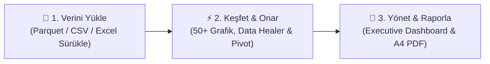

<div align="center">

# ⬡ DataViz Pro
### Milyonlarca Satırlık Büyük Veriyi Saniyeler İçinde Keşfedin, Akıllı Onarın ve Profesyonel Yönetici Raporlarına Dönüştürün

<p align="center">
  <strong>Geleneksel tablo yazılımlarının kilitlendiği devasa veri setlerinde kaybolmayın.<br>
  Excel, CSV ve Apache Parquet dosyalarınızı sürükleyip bırakın; Polars ve PyArrow motorlarıyla anında işleyin, 50+ interaktif grafikle görselleştirin, veri anomalilerini tek tıkla onarın, dinamik pivot tablolar türetin ve baskıya hazır kurumsal A4 PDF raporunuzu saniyeler içinde indirin.</strong>
</p>

<!-- Statü ve Rozetler -->
<p align="center">
  
  
  
  
</p>

<p align="center">
  
  
  
  
  
  
  
  
  
</p>

</div>

---

## 🧭 İçindekiler
- [Bu Proje Ne İşe Yarar?](#-bu-proje-ne-işe-yarar)
- [3 Adımlı Analiz İş Akışı](#-3-adımlı-analiz-iş-akışı)
- [Öne Çıkan Ana Yetenekler](#-öne-çıkan-ana-yetenekler)
  - [1. 50+ İnteraktif Plotly.js Grafiği & Akıllı Öneri](#1-50-i̇nteraktif-plotlyjs-grafiği--akıllı-öneri)
  - [2. 1 Milyon+ Satır Büyük Veri Gücü (Polars + PyArrow + Parquet)](#2-1-milyon-satır-büyük-veri-gücü-polars--pyarrow--parquet)
  - [3. Akıllı Veri ve Tip Onarma Laboratuvarı (Data Healer)](#3-akıllı-veri-ve-tip-onarma-laboratuvarı-data-healer)
  - [4. Dinamik Pivot Tablo Stüdyosu (Pivot Studio)](#4-dinamik-pivot-tablo-stüdyosu-pivot-studio)
  - [5. Çoklu Gösterge Panosu (Executive Dashboard Canvas)](#5-çoklu-gösterge-panosu-executive-dashboard-canvas)
  - [6. İleri Düzey İstatistik & Bilimsel Yorumlayıcı](#6-i̇leri-düzey-i̇statistik--bilimsel-yorumlayıcı)
  - [7. Çoklu Format Dışa Aktarma & A4 PDF Stüdyosu](#7-çoklu-format-dışa-aktarma--a4-pdf-stüdyosu)
  - [8. Veri Zenginleştirme: Çoklu Tablo Birleştirme (Join) & Formül Motoru](#8-veri-zenginleştirme-çoklu-tablo-birleştirme-join--formül-motoru)
- [Kurumsal Modüler Mimari](#-kurumsal-modüler-mimari)
- [Hızlı Başlangıç (1 Dakikada Çalıştırın)](#-hızlı-başlangıç-1-dakikada-çalıştırın)
- [REST API Referansı](#-rest-api-referansı)
- [Teknoloji Yığını](#-teknoloji-yığını)
- [Geliştirici](#-geliştirici)

---

## 🎯 Bu Proje Ne İşe Yarar?

İster yüz binlerce satırlık kurumsal satış kayıtları, ister karmaşık akademik araştırma verileri olsun; veri analistleri, yöneticiler ve araştırmacılar çoğunlukla şu üç darboğazla karşılaşır:
1. **Büyük Veri Kilitlenmeleri:** Excel veya basit araçlar 100K+ satırdan sonra çöker ya da dakikalarca donar.
2. **Kirli ve Bozuk Veri Tipleri:** Sayısal sütunlara karışmış para birimleri (`₺`, `$`, `TL`), sözel ifadeler (`Yok`, `N/A`, `Belirtilmedi`) grafik motorlarını kilitler ve hatalı hesaplamalara yol açar.
3. **Raporlama Zahmeti:** Grafikleri tek tek ekran görüntüsü alıp sunumlara yapıştırmak saatler sürer.

**DataViz Pro**, bu zorlukları sıfıra indiren modern, açık kaynaklı bir **Büyük Veri Analitik ve İş Zekası (BI)** ekosistemidir:
* **Saniyeler İçinde İşleme:** Rust temelli **Polars** ve **PyArrow** motoru sayesinde 1 Milyon+ satırlık veri setlerini belleği tüketmeden saniyeler içinde okur ve anında filtreler.
* **Kendi Kendini Onaran Veri:** **Data Healer** laboratuvarı ile sütunlardaki sözel sapmaları tespit eder; tek tıkla veriyi kaybetmeden sayısal tipe dönüştürür.
* **Akıllı Görselleştirme:** Seçilen sütun tiplerine göre en ideal grafikleri ışıldayan rozetlerle önerir; **50 farklı Plotly.js** grafik türünü anında çizer.
* **Baskıya Hazır PDF:** Seçilen grafikleri ve pivot tabloları tek sayfada toplar, A4 sayfa bölme korumasıyla toplantıya hazır kurumsal raporlara dönüştürür.

---

## ⚡ 3 Adımlı Analiz İş Akışı



| Aşama | Ne Yaparsınız? | Ne Kazanırsınız? |
|:---:|:---|:---|
| **1️⃣ Yükle** | `.parquet`, `.csv`, `.xlsx` veya `.xls` dosyanızı sürükleyin (veya tek tıkla örnek veriyi başlatın). | Polars motoru veriyi anında belleğe alır; sütun tipleri, eksik hücreler ve Excel sekmeleri sıfır gecikmeyle ayrıştırılır. |
| **2️⃣ Keşfet & Onar** | Anomali tarayıcısıyla bozuk tipleri onarın; sürükle-bırak eksen havuzuyla önerilen 50+ grafikten birine tıklayın. | Sayısal verideki sözel sapmalar otomatik temizlenir; korelasyonlar, trendler ve ANOVA/T-Testi bulguları canlı hesaplanır. |
| **3️⃣ Yönet & Raporla** | Beğendiğiniz grafikleri ve pivot matrisleri panoya sabitleyin (`📌`); notlarınızı ekleyip A4 PDF olarak dışa aktarın. | Dağınık ekran görüntüleri yerine kurumsal ölçekte, düzenlenebilir ve sayfalaması kusursuz yönetici raporları elde edin. |

---

## ✨ Öne Çıkan Ana Yetenekler

### 📊 1. 50+ İnteraktif Plotly.js Grafiği & Akıllı Öneri
DataViz Pro, verinizin yapısına göre en uygun görseli saniyeler içinde sunar. Sütunlarınızı X ve Y kutularına bıraktığınızda, sistem verinin doğasını (Zaman serisi, Kategorik, Sürekli Sayısal) analiz eder ve **önerilen grafik türlerini parlayan rozetlerle** vurgular.

Tüm grafikler tam etkileşimli, yakınlaştırılabilir (zoom), kaydırılabilir (pan) ve WebGL hızlandırmalıdır.

```text
┌──────────────────┬─────────────────────────────────────────────────────────────────────────────┐
│ Grafik Ailesi    │ Desteklenen Grafik Türleri                                                  │
├──────────────────┼─────────────────────────────────────────────────────────────────────────────┤
│ 📈 Trend         │ Çizgi, Spline (Yumuşak), Basamak (Step), Alan, Yığılmış Alan, Şelale        │
│                  │ (Waterfall), Mum (Candlestick - Finance), OHLC                              │
├──────────────────┼─────────────────────────────────────────────────────────────────────────────┤
│ 📊 Kıyaslama     │ Çubuk (Bar), Yatay Çubuk, Gruplu Çubuk, Yığılmış Çubuk, Huni (Funnel),      │
│                  │ Radar (Örümcek), Nokta Kıyas (Dotplot), Bullet / KPI, Dumbbell              │
├──────────────────┼─────────────────────────────────────────────────────────────────────────────┤
│ 📉 Dağılım       │ Histogram, 2D Histogram, Kutu (Box Plot), Keman (Violin), Şerit (Strip),    │
│                  │ Halı (Rug Plot), 2D Yoğunluk (Density), Hata Çubuğu (Errorbar)              │
├──────────────────┼─────────────────────────────────────────────────────────────────────────────┤
│ 🔵 İlişki &      │ Dağılım (Scatter), Balon (Bubble), Scatter Matrix (SPLOM), Isı Haritası    │
│    Matris        │ (Heatmap - Korelasyon), Paralel Koordinatlar, Paralel Kategoriler           │
├──────────────────┼─────────────────────────────────────────────────────────────────────────────┤
│ 🥧 Parça-Bütün   │ Pasta (Pie), Donut (Halka), Sunburst (Güneş Işını), Ağaç (Treemap),        │
│                  │ Huni Alanı (Funnel Area), Sarkıt (Icicle), Akış Diyagramı (Sankey)          │
├──────────────────┼─────────────────────────────────────────────────────────────────────────────┤
│ 🌌 3D &          │ 3D Scatter, 3D Çizgi, 3D Yüzey (Surface), Kontur (Contour), Polar Çubuk,    │
│    Bilimsel      │ Polar Scatter, Rüzgar Gülü (Windrose), Ternary (3 Eksen), Halı (Carpet),     │
│                  │ Eşyükselti Halısı (Contour Carpet), Coğrafi Dağılım Haritası (Scattergeo)   │
└──────────────────┴─────────────────────────────────────────────────────────────────────────────┘
```

---

### ⚡ 2. 1 Milyon+ Satır Büyük Veri Gücü (Polars + PyArrow + Parquet)
Klasik Python veri analitiği araçları devasa tablolarda yüksek bellek tüketimi nedeniyle çöker. DataViz Pro, veri okuma ve ön işleme hattında **Polars** ve **Apache Arrow** tabanlı modern bir altyapı kullanır:

* **Saniyeler İçinde Açılış:** 100 MB - 1 GB boyutundaki büyük CSV ve Apache Parquet (`.parquet`) dosyaları çok çekirdekli Rust paralel işlemcisiyle milisaniyeler içinde tabloya dökülür.
* **Sıfır Bellek Şişmesi (Zero-Copy):** Veri sütunları Arrow bellek blokları üzerinde tutulur; RAM tüketimi geleneksel Pandas kullanımına göre %60-80 oranında düşer.
* **1 Milyon Satırda Anlık Filtreleme:** Milyon satırlık tablolarda dahi tarih, kategori veya sayı aralığı filtreleri uygulandığında yanıt süresi 100 ms'nin altında kalır.
* **Akıllı Örnekleme (Smart Subsampling):** 50.000 satırın üzerindeki scatter veya yoğunluk grafiklerinde tarayıcı performansını korumak için veri dağılımını bozmayan akıllı temsilci örnekleme devreye girer.

---

### 🩺 3. Akıllı Veri ve Tip Onarma Laboratuvarı (Data Healer)
Gerçek dünya verilerinde en sık karşılaşılan sorun, sayısal sütunlara sözel veri girilmesidir (örneğin satış tutarı sütununa `1.250 TL`, `Yok`, `15%`, `3.500$` yazılması). Bu durum tüm sütunun metin (`object`) tipine dönmesine ve grafiklerde kullanılamamasına neden olur.

Data Healer modülü bu süreci otomatikleştirir:
* **Hızlı Anomali Tarayıcısı:** Veri yüklendiği anda sayısal olması muhtemel metin sütunlarını otomatik keşfeder ve kırmızı anomali rozetleriyle listeler.
* **Akıllı Para & Birim Temizleme:** `₺`, `$`, `€`, `TL`, `USD`, `EUR`, `kg`, `adet` gibi simgeleri ve boşlukları ayıklar; Türkçe (`1.250,50`) ve ABD (`1,250.50`) formatındaki ondalık/binlik ayrımını otomatik çözer.
* **Sözel İfadeleri Ayıklama:** `Yok`, `N/A`, `Bilinmiyor`, `Kayıp` gibi ifadeleri tespit eder.
* **Çok Seçenekli Onarma Modları:**
  * 🪄 **Akıllı Onar (`smart_heal`):** Sayıları ayıklar, kalan geçersiz değerleri sütun ortalaması ile ikame ederek veri kaybını önler.
  * 0️⃣ **Sözelleri 0 Yap (`fill_zero`):** Tüm geçersiz metinleri sıfıra dönüştürür.
  * 📈 **Ortalamayla Doldur (`fill_mean`):** Sayısal ortalamayla doldurur.
  * 🗑️ **Boş (NaN) Yap (`coerce_nan`):** Hatalı hücreleri NaN yapar, sütunu saf sayı tipine geçirir.
  * ❌ **Satırları Sil (`drop_rows`):** Hata içeren satırları tablodan çıkarır.
* **Tek Tıkla Toplu Onarım:** *“Tümünü Akıllı Onar”* butonuyla tespit edilen tüm sütunlar tek bir API çağrısında düzeltilir.

---

### 🎲 4. Dinamik Pivot Tablo Stüdyosu (Pivot Studio)
Excel'in Pivot Table deneyimini web tarayıcınıza taşır:
* **Sürükle & Bırak Boyutlandırma:** Sütun havuzundan dilediğiniz değişkenleri Satırlar (Rows), Sütunlar (Cols) ve Değerler (Values) alanlarına sürükleyin.
* **Çoklu Toplulaştırma Fonksiyonları:** Toplam (`Sum`), Ortalama (`Mean`), Adet (`Count`), Minimum (`Min`), Maksimum (`Max`).
* **Isı Haritası (Heatmap) Renklendirmesi:** Hücrelerdeki sayısal büyüklüklere göre dinamik renk gradyanı oluşturarak yüksek ve düşük performansları anında görselleştirir.
* **Doğrudan Dışa Aktarma:** Üretilen çapraz tabloyu tek tıkla TSV formatında panoya kopyalayabilir veya biçimlendirilmiş **Excel (`.xlsx`)** olarak indirebilirsiniz.

---

### 🎛️ 5. Çoklu Gösterge Panosu (Executive Dashboard Canvas)
Tek tek grafikler arasında kaybolmak yerine, birbiriyle ilişkili grafikleri ve pivot tabloları tek ekranda toplayın:
* **Panoya Sabitleme (Pin):** Herhangi bir grafik veya pivot tablosu oluşturduğunuzda üst kısımdaki **`📌 Panoya Ekle`** butonuna basarak gösterge panonuza kaydedin.
* **Çoklu Kart İzleme:** Çizilen tüm grafikler duyarlı (responsive) ızgara düzeninde yan yana sıralanır.
* **Düzenlenebilir Başlıklar:** Panodaki grafik kartlarının başlıklarına tıklayarak toplantı veya sunum diline uygun özel isimler verebilirsiniz.
* **Özet KPI Şeridi:** Toplam kayıt sayısı, ana toplamlar ve dağılım oranları pano üzerinde otomatik özetlenir.
* **Tek Tıkla Pano Raporu:** Panodaki tüm görselleri tek seferde çok sayfalı kurumsal PDF'e aktarın.

---

### 🔬 6. İleri Düzey İstatistik & Bilimsel Yorumlayıcı
DataViz Pro, grafik çizmenin ötesinde SciPy motoruyla kuramsal hipotez testleri yürütür ve bulguları akademik dille özetler:

* **Hipotez Testleri:**
  * **Bağımsız Örneklem T-Testi ($t$):** İki grup arasındaki ortalama farkın istatistiksel olarak anlamlı olup olmadığını ($p$-değeri ile) sınar.
  * **Tek Yönlü ANOVA ($F$):** Üç veya daha fazla grup arasındaki varyansı test eder.
* **Korelasyon Analizleri:**
  * **Pearson ($r$):** Doğrusal ilişkiler için parametrik korelasyon.
  * **Spearman ($\rho$):** Sıralı ve parametrik olmayan ilişkiler için rank korelasyonu.
  * **Kendall ($\tau$):** Küçük veya aykırı değer içeren veri setleri için dayanıklı korelasyon.
* **Eğri Uydurma & Regresyon Modelleri:**
  * **Doğrusal (Linear):** $y = mx + c$
  * **2. ve 3. Derece Polinom:** $y = ax^2 + bx + c$ ve $y = ax^3 + bx^2 + cx + d$
  * **Logaritmik:** $y = a \cdot \ln(x) + b$
  * **Üstel (Exponential):** $y = a \cdot e^{bx}$
  * Belirlilik katsayısı ($R^2$), standart hata ve $p$-değeri anlık hesaplanır; trend eğrisi grafiğin üzerine bindirilir.
* **Yapay Zeka Destekli Akademik Yorumlayıcı:** Test sonuçlarını, p-değerlerinin anlamlılığını ve regresyon gücünü APA formatına uygun Türkçe akademik paragraflarla otomatik yorumlar.

---

### 📄 7. Çoklu Format Dışa Aktarma & A4 PDF Stüdyosu
* **Çoklu Format Desteği:** Filtrelenmiş veya onarılmış verinizi dilediğiniz zaman **CSV**, **Excel (`.xlsx`)** veya ultra sıkıştırılmış **Apache Parquet (`.parquet`)** formatında dışa aktarın.
* **A4 PDF Stüdyosu:** `html2pdf.js` destekli yazdırma motoru, görselleri ve tabloları A4 sayfa sınırlarına göre otomatik ölçeklendirir:
  * Sayfa ortasında grafik bölünmesini önleyen akıllı sayfalama koruması.
  * Rapor bloklarını `↑` ve `↓` butonlarıyla yukarı-aşağı taşıma imkânı.
  * Grafiklerin arasına **`+ Metin Ekle`** butonuyla serbest yönetici notları ve analiz açıklamaları ekleyebilme.

---

### 🔗 8. Veri Zenginleştirme: Çoklu Tablo Birleştirme (Join) & Formül Motoru
* **Akıllı Tablo Birleştirici (Merge & Join):** İkinci bir Parquet, CSV veya Excel tablosunu sisteme yükleyin; ortak ID/kod/tarih sütunlarını sistem otomatik eşleştirsin. `Left`, `Right`, `Inner` veya `Outer` join türleriyle iki veri setini anında birleştirin.
* **Formül Sihirbazı:** Kod yazmadan dört işlem (`+`, `-`, `*`, `/`) veya sabit katsayılarla yeni hesaplanmış sütunlar (örneğin `Kâr = Satış - Maliyet` veya `KDV_Dahil = Tutar * 1.20`) türetin. Sıfıra bölünme hatalarına karşı korumalıdır.

---

## 🏛️ Kurumsal Modüler Mimari

DataViz Pro, kurumsal sürdürülebilirlik ilkelerine uygun olarak **Flask Blueprints** ve **Frontend ES6 Modülleri** ile baştan sona modüler bir mimaride tasarlanmıştır:

```mermaid
flowchart TD
    subgraph Client ["🖥️ Modern Web Arayüzü (static/js/modules/)"]
        UI["Arayüz Şablonları\n(templates/analysis.html, landing.html)"]
        CM["chart_manager.js\n(Havuz, 50+ Grafik & Pano)"]
        CC["charts_config.js\n(Meta-Veri & Plotly Düzenleri)"]
        DP["data_prep.js\n(Data Healer & NaN Modalı)"]
        PS["pivot_studio.js\n(Dinamik Pivot Stüdyosu)"]
        PDF["pdf_studio.js\n(A4 Raporlama Motoru)"]
        JM["join_modal.js\n(Çoklu Tablo Birleştirme)"]
        GB["globals.js\n(Reaktif Durum / State)"]
    end

    subgraph Blueprints ["⚡ Flask Blueprint Katmanı (routes/)"]
        MR["main_routes.py\n(/, /analysis, /load_sample)"]
        UR["upload_routes.py\n(/upload, /switch_sheet)"]
        DR["data_routes.py\n(/check_health, /repair_column_anomalies, /merge_datasets)"]
        CR["chart_routes.py\n(/get_chart_data, /get_column_values)"]
        SR["stats_routes.py\n(/get_stats, /get_kpi_summary, /generate_insight)"]
        ER["export_routes.py\n(/export_data, /get_pivot_data, /export_pivot)"]
    end

    subgraph Services ["🧠 İş Mantığı & Hesaplama Çekirdeği (services/ & core/)"]
        STORE["core/store.py\n(Bellekçi Veri Deposu)"]
        CFG["core/config.py\n(Sunucu Yapılandırması)"]
        FS["services/file_service.py\n(Polars + PyArrow + Pandas Hızlı Okuyucu)"]
        DH["services/data_healer.py\n(Sözel Anomali Ayıklama & Akıllı Onarım)"]
        SS["services/stats_service.py\n(SciPy ANOVA, T-Test, Regresyon Modelleri)"]
        AIS["services/ai_service.py\n(Akademik APA Yorum Üretimi)"]
        EXS["services/export_service.py\n(CSV, Excel, Parquet Akışları)"]
    end

    Client --> Blueprints
    Blueprints --> Services
```



### 📂 Dosya ve Klasör Hiyerarşisi

```text
dataviz/
├── app.py                          # Hafif Uygulama Fabrikası (Flask Blueprints Kaydı)
├── requirements.txt                # Polars, PyArrow, Flask, SciPy, openpyxl bağımlılıkları
├── Dockerfile                      # Çok platformlu hafif Docker imaj tanımı
├── docker-compose.yml              # Tek komutla ayağa kaldırma orkestrasyonu
├── DEMO_BASLAT.bat                 # Windows tek tıkla otomatik başlatıcı
├── README.md                       # Kapsamlı proje vitrini ve teknik dokümantasyon
│
├── core/                           # Çekirdek Yapılandırma ve Durum Yönetimi
│   ├── config.py                   # Port, debug, yükleme limitleri ve dosya yolları
│   └── store.py                    # İşlem içi (in-memory) veri seti ve Excel oturum deposu
│
├── routes/                         # Flask REST API Blueprints Katmanı
│   ├── __init__.py                 # Modüler blueprint kayıt orkestratörü
│   ├── main_routes.py              # Vitrin, ana stüdyo, sağlık kontrolü ve hazır örnek veri
│   ├── upload_routes.py            # CSV, Excel, Parquet yükleme ve sekme değiştirme
│   ├── data_routes.py              # Data Healer, anomali onarımı, NaN temizleme, Join ve Formül
│   ├── chart_routes.py             # 50+ grafik veri toplulaştırma ve regresyon eğrileri
│   ├── stats_routes.py             # ANOVA, T-Testi, korelasyon, KPI özetleri ve AI yorumu
│   └── export_routes.py            # CSV, Excel, Parquet indirme ve Pivot tablosu çıktısı
│
├── services/                       # İş Mantığı, İstatistik ve Büyük Veri Servisleri
│   ├── file_service.py             # Polars + PyArrow + Pandas çok çekirdekli okuyucu
│   ├── data_healer.py              # Sözel anomali dedektörü ve akıllı tip dönüştürücü
│   ├── stats_service.py            # SciPy hipotez testleri, çoklu regresyon ve pivot matrisleri
│   ├── ai_service.py               # APA standartlarında bilimsel/yönetici yorumlayıcı
│   └── export_service.py           # Çoklu format bellek akışı üreticileri
│
├── templates/                      # Jinja2 HTML Şablonları
│   ├── landing.html                # Modern cam efektli açılış ve karşılama vitrini
│   ├── analysis.html               # 3 adımlı analitik stüdyo, pano ve A4 PDF arayüzü
│   └── a4_demo.html                # Bağımsız A4 PDF Stüdyosu simülatörü
│
└── static/                         # İstemci Tarafı Varlıkları
    ├── css/                        # Modüler CSS stilleri (analysis.css, landing.css, style.css)
    └── js/
        ├── app.js                  # Olay dinleyicileri, klavye kısayolları ve UI akışı
        ├── landing.js              # Açılış sayfası animasyonları
        ├── three_scene.js          # Three.js etkileşimli 3D arka plan efekti
        └── modules/                # ES6 İstemci Modülleri
            ├── globals.js          # Global reaktif değişkenler ve durum yönetimi
            ├── charts_config.js    # 50+ grafik türünün meta-veri tanımları ve Plotly motoru
            ├── chart_manager.js    # Sürükle-bırak havuzu, pano sabitleme ve görselleştirici
            ├── data_prep.js        # Veri sağlığı, tip onarma ve NaN temizleme kontrolcüsü
            ├── pivot_studio.js     # Excel tarzı dinamik Pivot Tablo Stüdyosu
            ├── pdf_studio.js       # A4 sayfalama, metin bloğu ekleme ve PDF dönüştürücü
            └── join_modal.js       # Çoklu dosya birleştirme sihirbazı
```

---

## 🚀 Hızlı Başlangıç (1 Dakikada Çalıştırın)

Sisteminizde **Python 3.10 veya üzeri** kurulu olması yeterlidir.

### Seçenek 1: 🪟 Windows İçin Tek Tıkla Başlatıcı (En Kolayı)
Komut satırı kullanmak istemiyorsanız:
1. Proje klasöründeki **`DEMO_BASLAT.bat`** dosyasına çift tıklayın.
2. Gerekli sanal ortam otomatik kontrol edilir ve sunucu ayağa kalkar.
3. Varsayılan web tarayıcınızda `http://127.0.0.1:5000` otomatik açılır!

---

### Seçenek 2: ⚡ `uv` ile Işık Hızında Başlatma (Geliştiriciler İçin)
Modern Python paket yöneticisi **Astral uv** ile saniyeler içinde çalıştırın:
```bash
# Projeyi klonlayın
git clone https://github.com/UmutcaNN00/dataviz.git
cd dataviz

# Bağımlılıkları otomatik çözüp sunucuyu başlatın
uv run python app.py
```
Tarayıcınızda **`http://127.0.0.1:5000`** adresine gidin.

---

### Seçenek 3: Standart `pip` ile Kurulum
```bash
git clone https://github.com/UmutcaNN00/dataviz.git
cd dataviz

# Sanal ortam oluşturup aktif edin
python -m venv .venv
source .venv/bin/activate        # Windows PowerShell: .venv\Scripts\Activate.ps1

# Bağımlılıkları yükleyip başlatın
pip install -r requirements.txt
python app.py
```

---

### Seçenek 4: 🐳 Docker & Docker Compose ile Platform Bağımsız Kurulum
Sisteminizde Python veya kütüphane kurulu olmasa bile Docker ile izole olarak çalıştırabilirsiniz:
```bash
# Docker Compose ile arka planda başlatma:
docker compose up -d

# Logları takip etmek için:
docker compose logs -f
```
Tarayıcınızda **`http://localhost:5000`** adresine gidin.

---

## 🔌 REST API Referansı

DataViz Pro, kurumsal entegrasyonlar için zengin bir REST API uç nokta kümesi sunar:

| Uç Nokta | Metot | Blueprint | Açıklama |
|---|:---:|:---:|---|
| `/` | `GET` | `main` | Açılış ve karşılama sayfasını görüntüler. |
| `/analysis` | `GET` | `main` | 3 adımlı analitik ve raporlama stüdyosunu açar. |
| `/health` | `GET` | `main` | Sunucu ve Polars motoru canlılık kontrolü (`JSON`). |
| `/load_sample` | `POST` | `main` | Anında test için hazır örnek veri setini belleğe yükler. |
| `/upload` | `POST` | `upload` | Parquet, CSV ve Excel dosyalarını yükler, başlık ve tipleri ayrıştırır. |
| `/switch_sheet` | `POST` | `upload` | Excel çalışma kitabında aktif sayfayı (sheet) değiştirir. |
| `/check_health` | `GET` | `data` | Boş hücre (NaN) ve sözel tip uyumsuzluğu (anomali) taraması yapar. |
| `/repair_column_anomalies` | `POST` | `data` | Belirli bir sütundaki veya tüm sütunlardaki sözel sapmaları akıllıca onarır. |
| `/clean_data` | `POST` | `data` | Boş hücreleri ortalama/sıfır/medyan ile doldurur veya satırları siler. |
| `/preview_second_file` | `POST` | `data` | Birleştirilecek 2. tablonun sütunlarını ve ortak anahtar adaylarını tarar. |
| `/merge_datasets` | `POST` | `data` | İki tabloyu seçilen ortak anahtar üzerinden birleştirir (`Left`, `Right`, `Inner`, `Outer`). |
| `/create_calculated_column` | `POST` | `data` | Dört işlem veya katsayıyla yeni türetilmiş formül sütunu oluşturur. |
| `/get_chart_data` | `POST` | `chart` | Filtrelenmiş veriyle 50+ grafik tipine uygun ham veya toplulaştırılmış veri döner. |
| `/get_stats` | `POST` | `stats` | ANOVA, T-Testi, korelasyon katsayıları ve regresyon eğrilerini hesaplar. |
| `/get_kpi_summary` | `POST` | `stats` | Gösterge panosu için toplam kayıt, ana toplam ve dağılım KPI kartlarını üretir. |
| `/generate_insight` | `POST` | `stats` | İstatistiksel test sonuçlarını APA formatında akademik yorum metnine dönüştürür. |
| `/get_pivot_data` | `POST` | `export` | Dinamik satır/sütun/değer çaprazlama pivot matrisini hesaplar. |
| `/export_pivot` | `POST` | `export` | Üretilen pivot tablosunu biçimlendirilmiş `.xlsx` Excel dosyası olarak indirir. |
| `/export_data` | `POST` | `export` | Filtrelenmiş aktif veriyi `.parquet`, `.csv` veya `.xlsx` formatında akışla indirir. |

---

## 🛠 Teknoloji Yığını

| Katman | Teknoloji | Görevi ve Önemi |
|---|---|---|
| **Büyük Veri Motoru** | `Polars 1.0+` & `PyArrow` | Milyonlarca satırlık tablolarda çok çekirdekli Rust hızında filtreleme ve bellek optimizasyonu. |
| **Depolama Formatı** | `Apache Parquet` | Yüksek sıkıştırmalı, sütunsal ve sıfır gecikmeli büyük veri saklama standardı. |
| **Backend API** | `Python 3.10+`, `Flask 3.0+` | Blueprints tabanlı, yüksek modülerlikte REST servis mimarisi. |
| **İstatistik Motoru** | `SciPy 1.11+` & `NumPy` | ANOVA ($F$), T-Testi ($t$), Pearson/Spearman/Kendall korelasyonu ve OLS regresyon eğrileri. |
| **Excel Desteği** | `openpyxl` | Çok sayfalı modern `.xlsx` kitaplarını okuma ve şablonlu dışa aktarma. |
| **İnteraktif Grafikler** | `Plotly.js 2.27.0` | 50+ grafik türünde WebGL hızlandırmalı, dinamik görselleştirme kütüphanesi. |
| **Kurumsal PDF Çıktısı** | `html2pdf.js 0.10.1` | Sayfa bölme korumalı, ölçeklenebilir ve baskıya hazır A4 yönetici raporları. |
| **Paket & Konteyner** | `Astral uv` & `Docker` | Sıfır kurulum bekleme süresi, tam taşınabilirlik ve izole üretim ortamı. |

---

## ⌨️ Klavye Kısayolları

Analiz stüdyosundayken aşağıdaki kısayolları kullanarak işlemlerinizi hızlandırabilirsiniz:

| Tuş | İşlev |
|:---:|:---|
| <kbd>G</kbd> | Grafik Sekmesine Geçiş |
| <kbd>S</kbd> | İstatistik Analizi Sekmesine Geçiş |
| <kbd>D</kbd> | Çoklu Gösterge Panosuna (Dashboard) Geçiş |
| <kbd>P</kbd> | Aktif Grafiği Gösterge Panosuna Sabitleme (Pin) |
| <kbd>?</kbd> | Kısayol Yardım Menüsünü Açma |
| <kbd>Esc</kbd> | Açık Olan Tüm Modalları ve Pencereleri Kapatma |

---

## 👨‍💻 Geliştirici

Bu proje **Umutcan** ([@UmutcaNN00](https://github.com/UmutcaNN00)) tarafından veri bilimi çalışmaları, büyük veri iş zekası analitiği ve kurumsal karar destek sistemleri doğrultusunda titizlikle geliştirilmiştir.

<br>

<div align="center">
  <sub>Modern Büyük Veri ve İş Zekası Analitiği için Geliştirildi • <b>DataViz Pro</b> 2026</sub>
</div>
