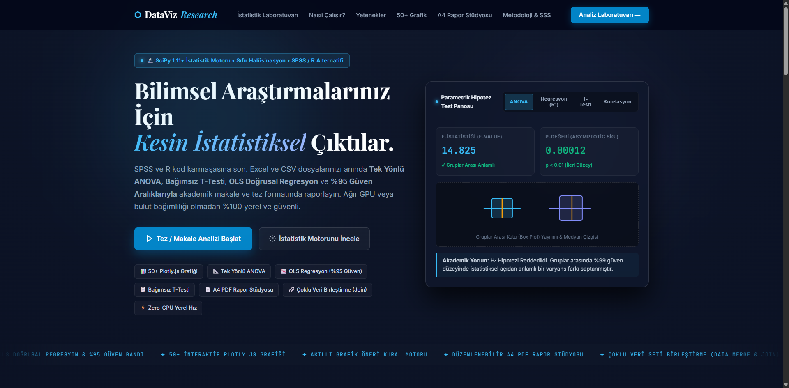
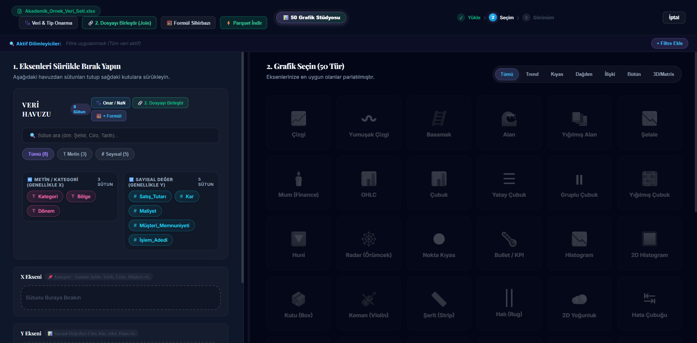

<div align="center">

# ⬡ DataViz

**Premium Glassmorphism Arayüzü ile Milyonlarca Satırlık Büyük Veriyi Saniyeler İçinde Keşfedin, Onarın ve Raporlayın**

<p align="center">
  Geleneksel tablo yazılımlarının sınırlarını aşın! <strong>DataViz</strong>; Excel, CSV ve Apache Parquet dosyalarınızı sürükleyip bırakarak anında analiz etmenizi sağlayan yeni nesil bir iş zekası (BI) platformudur. <br><br>
  <strong>Premium Glassmorphism</strong> arayüzü ile muhteşem bir kullanıcı deneyimi sunarken, arkasındaki <strong>Polars ile hızlandırılmış motor</strong> sayesinde devasa verileri milisaniyeler içinde işler.
</p>

<p align="center">
  
  
  
  
</p>
</div>

<br>
<p align='center'>
  
</p>
<p align='center'>
  
</p>


---

## 🚀 Öne Çıkan Son Güncellemeler ve Özellikler

### 💎 Premium Glassmorphism Arayüz
Kullanıcı deneyimini baştan tanımlayan şeffaf, modern ve akıcı "Glassmorphism" tasarımıyla verilerinize odaklanırken görsel bir şölen yaşayın. Yenilenmiş animasyonlar ve sezgisel navigasyon ile veri analizini bir sanat eserine dönüştürün.

### ⚡ Polars ile Hızlandırılmış Motor
Pandas'ın darboğazlarını geride bırakın! Rust temelli Polars motoru ile **1 Milyon+ satırlık** devasa veri setleri saniyeler içinde belleğe yüklenir, filtrelenir ve işlenir. %80'e varan daha az RAM tüketimi ile bilgisayarınızı yormadan büyük veri analizi yapın.

### 🩺 Akıllı Veri Sağlığı Onarıcı (Data Healer)
Bozuk veya kirli verilerle uğraşmaya son! `₺`, `$`, `Yok`, `N/A` gibi sayısal sütunlara karışmış sözel sapmaları otomatik algılar. "Akıllı Onarım" algoritmasıyla veri kaybı yaşamadan tüm anomalileri tek tıkla saf sayısal tiplere dönüştürür.

### 🪄 Advanced Formül Sihirbazı
Kod yazmadan, Excel formüllerinden bile daha kolay! Gelişmiş formül motoru sayesinde mevcut verilerinizden türetilmiş yeni metrikler (örn: `Kâr = Satış - Maliyet * 1.20`) oluşturun. Dört işlem ve sabit katsayılarla anında yeni sütunlar hesaplayın.

### 📊 Plotly 50+ Grafik Motoru
Sıradan çubuk grafiklerin ötesine geçin! Akıllı öneri sistemiyle verinize en uygun grafik türü otomatik sunulur. Finansal, bilimsel, 3D ve istatistiksel tam **50 farklı Plotly.js grafiği** ile verilerinizi konuşturun, yakınlaştırın ve detaylarda gezinin.

---

## ⚡ 3 Adımlı Hızlı İş Akışı

```mermaid
flowchart LR
    A["📂 1. Sürükle & Bırak\n(Parquet / CSV / Excel)"] --> B["⚡ 2. Keşfet & Onar\n(Data Healer & 50+ Grafik)"]
    B --> C["📄 3. Yönet & Raporla\n(Advanced Formül & PDF)"]
```



---

## 🛠 Kurulum Adımları (1 Dakikada Hazır)

Sisteminizde **Python 3.10+** kurulu olması yeterlidir.

### Seçenek 1: 🪟 Windows Tek Tıkla Başlatıcı (En Kolayı)
Sadece proje dizinindeki **`DEMO_BASLAT.bat`** dosyasına çift tıklayın. Her şey otomatik kurulur ve tarayıcınızda açılır!

### Seçenek 2: ⚡ `uv` veya `pip` ile Hızlı Kurulum (Geliştiriciler)
```bash
# Projeyi klonlayın
git clone https://github.com/UmutcaNN00/dataviz.git
cd dataviz

# Sanal ortam oluÅŸturun ve aktif edin
python -m venv .venv
source .venv/bin/activate  # Windows için: .venv\Scripts\activate

# Gerekli paketleri kurun ve çalıştırın
pip install -r requirements.txt
python app.py
```
Ardından tarayıcınızdan **`http://127.0.0.1:5000`** adresine gidin.

### Seçenek 3: 🐳 Docker ile Kurulum
```bash
docker-compose up -d
```

---

## 🧩 Modüler Mimari ve Altyapı

DataViz, kurumsal sürdürülebilirlik ilkelerine uygun olarak **Flask Blueprints** ve **Modern ES6 İstemci Modülleri** ile inşa edilmiştir:

* **Büyük Veri İşleme:** `Polars`, `PyArrow`
* **Backend API Katmanı:** `Python 3.10+`, `Flask 3.0+`
* **Görselleştirme:** `Plotly.js 2.27.0` (50+ Dinamik Grafik)
* **Ä°statistik & AI:** `SciPy 1.11+` (ANOVA, T-Test, Korelasyonlar)
* **Tasarım:** Premium Glassmorphism UI (CSS3 + Modern JS)

---

## 👨‍💻 Geliştirici

Bu proje, veri bilimi ve büyük veri analitiğine tutkuyla bağlı olan **Umutcan** ([@UmutcaNN00](https://github.com/UmutcaNN00)) tarafından geliştirilmiştir.

<div align="center">
  <sub>Büyük Veri İş Zekası ve Yönetim Sistemleri için Yeniden Tanımlandı • <b>DataViz</b> 2026</sub>
</div>

