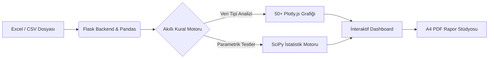

<div align="center">

# ⬡ DataViz Pro
### Yeni Nesil İnteraktif Veri Analizi, İstatistik ve İş Zekası (BI) Platformu

<p align="center">
  <strong>Ham Excel ve CSV veri kümelerini; akıllı kural motoruyla 50+ interaktif grafiğe, ileri düzey parametrik hipotez testlerine (ANOVA, T-Test, Regresyon) ve dinamik A4 PDF raporlama stüdyosuna dönüştüren hafif, donanım dostu web platformu.</strong>
</p>

<p align="center">
  
  
  
  
</p>

<p align="center">
  
  
  
  
  
  
</p>

<br>

> ⚡ **Sıfır Bulut Bağımlılığı & Donanım Dostu:** Ağır yapay zeka modelleri (LLM) veya yüksek GPU maliyetleri gerektirmez. Tüm veri işleme, hipotez testleri ve tahminlemeler yerel Python ve SciPy algoritmalarıyla milisaniyeler içinde gerçekleştirilir.

</div>

---

## 📌 İçindekiler
- [Mimari Genel Bakış](#-mimari-genel-bakış)
- [Akıllı Grafik Öneri Motoru](#-akıllı-grafik-öneri-motoru)
- [Temel Özellikler](#-temel-özellikler)
  - [1. Veri Hazırlama & Formül Motoru](#1-veri-hazırlama--formül-motoru)
  - [2. 50+ İnteraktif Görselleştirme](#2-50-interaktif-görselleştirme)
  - [3. Akademik İstatistik & Hipotez Testleri](#3-akademik-istatistik--hipotez-testleri)
  - [4. Etkileşimli A4 PDF Rapor Stüdyosu](#4-etkileşimli-a4-pdf-rapor-stüdyosu)
- [Hızlı Başlangıç & Kurulum](#-hızlı-başlangıç--kurulum)
- [Proje Mimarisi & Dosya Yapısı](#-proje-mimarisi--dosya-yapısı)
- [API Uç Noktaları (Endpoints)](#-api-uç-noktaları-endpoints)
- [Geliştirici & Katkıda Bulunma](#-geliştirici--katkıda-bulunma)

---

## 🏛 Mimari Genel Bakış

DataViz Pro, kurumsal iş zekası (BI) araçlarının hantallığını ortadan kaldırmak ve veri bilimi süreçlerini akademik hassasiyetle web arayüzüne taşımak amacıyla tasarlanmıştır.



---

## 🎯 Akıllı Grafik Öneri Motoru

Platform, rastgele grafikler sunmak yerine seçilen eksenlerin **matematiksel tipolojisini**, **kardinalitesini** ve **zaman serisi özelliklerini** analiz eden yerleşik bir kural motoruna (`evaluateCharts`) sahiptir:

| Eksen Kombinasyonu | Veri Türü Dinamiği | Önerilen Grafikler (✨ Rozetli) |
|---|---|---|
| **X (Tarih) + 1 Sayısal Y** | Zaman Serisi / Trend | `Çizgi (Line)`, `Yumuşak Çizgi (Spline)`, `Alan (Area)`, `Basamak (Step)`, `Şelale (Waterfall)` *(Finansal kolonlar varsa: `Mum (Candlestick)`, `OHLC`)* |
| **X (Tarih) + 2+ Sayısal Y** | Kümülatif & Çoklu Trend | `Çoklu Çizgi`, `Yığılmış Alan (Stacked Area)`, `Gruplu Çubuk`, `Yığılmış Çubuk` |
| **X (Kategori) + 1 Sayısal Y** | Tekil Karşılaştırma & Dağılım | `Çubuk`, `Yatay Çubuk`, `Pasta`, `Donut`, `Radar (Örümcek)`, `Ağaç (Treemap)`, `Sunburst`, `Huni (Funnel)`, `Nokta Kıyas (Dotplot)`, `Şelale`, `Bullet (KPI)` |
| **X (Kategori) + 2+ Sayısal Y** | Çok Boyutlu Profilleme | `Radar`, `Gruplu Çubuk`, `Yığılmış Çubuk`, `Isı Haritası (Heatmap)`, `Sarkıt (Icicle)`, `Akış (Sankey)`, `Paralel Kategoriler (Parcats)` |
| **X (Sayısal) + 1 Sayısal Y** | İki Değişkenli Korelasyon | `Dağılım (Scatter)`, `Balon (Bubble)`, `2D Yoğunluk (Density2D)`, `2D Histogram`, `Çizgi` |
| **3 Sayısal Değişken** | Uzaysal / 3D Dağılım | `3D Scatter`, `3D Çizgi`, `3D Yüzey (Surface)`, `Kontur`, `Ternary (Üçgen)` |
| **4+ Sayısal Değişken** | Çok Değişkenli Matris | `Scatter Matrix (SPLOM)`, `Paralel Koordinatlar (Parcoords)`, `Isı Haritası (Heatmap)` |
| **Yalnızca 1 Sayısal Y (X Yok)** | Tek Değişkenli İstatistiksel Dağılım | `Histogram`, `Kutu (Box Plot)`, `Keman (Violin)`, `Şerit (Strip)`, `Halı (Rug)`, `Bullet (KPI)` |

---

## 🚀 Temel Özellikler

### 1. Veri Hazırlama & Formül Motoru
* **Çoklu Format Desteği:** `.xlsx`, `.xls` ve `.csv` dosyalarını sürükle-bırak yöntemiyle yükleme.
* **Akıllı Sayfa Yönetimi:** Excel çalışma kitaplarındaki farklı sayfaları (sheets) anında seçebilme.
* **Veri Birleştirme (Join/Merge):** İki bağımsız veri setini ortak bir anahtar sütun (`Left`, `Right`, `Inner`, `Outer`) üzerinden tekilleştirme.
* **Aritmetik Formül Üretici:** Sayısal sütunlar arasında Dört İşlem (Toplama, Çıkarma, Çarpma, Bölme) ile anında yeni türetilmiş sütunlar oluşturma (Sıfıra bölünme ve NaN korumalı).
* **Dinamik Dilimleyiciler (Slicers):** Metinsel veya sayısal aralık bazlı anlık veri filtreleme.

### 2. 50+ İnteraktif Görselleştirme
* **Plotly.js Entegrasyonu:** Tüm grafiklerde donanım hızlandırmalı yakınlaştırma (zoom), kaydırma (pan) ve fare ile üzerine gelme (tooltip) desteği.
* **Gelecek Tahminleme (Forecasting):** Zaman serisi ve trend grafiklerinde doğrusal regresyon ve %95 güven bandı (`Confidence Interval`) ile gelecek periyot projeksiyonu.
* **Sürüklenebilir Bölücü (Splitter):** Değişken havuzu ile grafik seçim paneli arasındaki dikey ayırıcıyı fareyle esnetebilme.
* **Karanlık Mod & Özel Renk Paletleri:** Apple/Mac standartlarında 6px ultra-ince kaydırma çubukları, neon vurgular ve glassmorphism kart tasarımı.

### 3. Akademik İstatistik & Hipotez Testleri
Veri setinde seçilen sayısal metrikler, Python'un `scipy.stats` kütüphanesi üzerinden kuramsal testlerden geçirilir:
* **Merkezi Eğilim & Yayılım:** Ortalama, Medyan, Minimum, Maksimum, Standart Sapma, Eksik Veri Frekansı.
* **Tek Yönlü Varyans Analizi (One-Way ANOVA):** Kategorik grupların ortalamaları arasındaki istatistiksel anlamlılığı test eder ($F$ İstatistiği ve $p$-değeri).
* **Bağımsız Örneklem T-Testi:** İki grup arasındaki ortalama farkının şans eseri olup olmadığını belirler ($t$ İstatistiği ve $p$-değeri).
* **Pearson Korelasyon & OLS Regresyon:** Değişkenler arası doğrusal ilişki katsayısı ($r$), Belirlilik Katsayısı ($R^2$) ve açık Regresyon Denklemi ($y = mx + c$).
* **Akademik Raporlayıcı:** İstatistiksel sonuçları resmi ve bilimsel bir terminolojiyle otomatik yorumlar.

### 4. Etkileşimli A4 PDF Rapor Stüdyosu
* **İnteraktif Düzenleme Tuvali:** İndirmeden önce raporunuzu birebir A4 sayfa oranlarında önizleyin.
* **Yeniden Sıralama & Çıkarma:** Blokları `↑` ve `↓` butonlarıyla yukarı-aşağı taşıyın, istemediğiniz grafikleri tek tıkla rapordan kaldırın.
* **Dinamik Yönetici Notları:** "+ Metin Ekle" butonu ile grafiklerin arasına `contenteditable` serbest yorum alanları yerleştirin.
* **Akıllı Çoklu Sayfalama:** 10+ grafik veya tablo eklendiğinde grafikleri ortadan ikiye bölmeden, mantıklı sayfa sonlarıyla (`pagebreak: avoid-all`) çok sayfalı A4 PDF oluşturma.

---

## 💻 Hızlı Başlangıç & Kurulum

### Gereksinimler
* **Python 3.10 veya üzeri**
* **[uv](https://docs.astral.sh/uv/getting-started/installation/)** (Önerilen modern paket yöneticisi) veya geleneksel `pip`

### 1. Projeyi Klonlayın
```bash
git clone https://github.com/UmutcaNN00/dataviz.git
cd dataviz
```

### 2. Sanal Ortamı Hazırlayın ve Bağımlılıkları Yükleyin
```bash
# uv kullanarak (Önerilen - saniyeler içinde tamamlanır)
uv venv
uv pip install -r requirements.txt

# veya geleneksel pip ile:
python -m venv .venv
source .venv/bin/activate  # Windows için: .venv\Scripts\activate
pip install -r requirements.txt
```

### 3. Uygulamayı Başlatın
```bash
uv run python app.py
# veya
python app.py
```
Tarayıcınızda **`http://127.0.0.1:5000`** adresine gidin.

### 🪟 Windows İçin Tek Tıkla Başlatıcı
Proje dizininde yer alan **`DEMO_BASLAT.bat`** dosyasına çift tıklamanız yeterlidir. Sunucu otomatik başlatılacak ve varsayılan tarayıcınızda analiz ekranı açılacaktır.

---

## 📂 Proje Mimarisi & Dosya Yapısı

```
dataviz/
├── app.py                      # Flask ana uygulama motoru, REST API ve istatistik servisleri
├── requirements.txt            # Çekirdek Python bağımlılıkları (Flask, Pandas, SciPy, NumPy)
├── DEMO_BASLAT.bat             # Windows tek tıkla otomatik başlatma komut dosyası
├── README.md                   # Kapsamlı kurumsal dokümantasyon
├── modules/
│   ├── __init__.py
│   └── data_processing.py      # Veri temizleme, filtreleme ve toplulaştırma yardımcıları
├── templates/
│   ├── landing.html            # 3D karşılama ve tanıtım arayüzü
│   ├── analysis.html           # 3 adımlı sihirbaz ve ana analiz laboratuvarı
│   └── index.html              # Akıllı yönlendirme şablonu
└── static/
    ├── css/
    │   ├── analysis.css        # Analiz laboratuvarı, cam efekti (glassmorphism) ve scrollbar stilleri
    │   ├── landing.css         # Açılış sayfası tipografi ve responsive düzeni
    │   └── style.css           # Global CSS değişkenleri ve yardımcı sınıflar
    └── js/
        ├── app.js              # Kural motoru, Plotly çizicileri, sürükle-bırak ve PDF stüdyosu
        ├── landing.js          # Karşılama sayfası etkileşimleri
        ├── three_scene.js      # Three.js 3D interaktif arka plan animasyonu
        └── modules/
            ├── charts_config.js # 50 grafik tipinin meta-veri ve kategori tanımları
            └── globals.js       # Durum yönetimi (State) ve global değişkenler
```

---

## 🔌 API Uç Noktaları (Endpoints)

| Endpoint | Metot | Açıklama |
|---|---|---|
| `/upload` | `POST` | Excel/CSV dosyasını yükler, sütun tiplerini ayrıştırır. |
| `/get_chart_data` | `POST` | Seçilen eksenler ve filtreler için ham/toplulaştırılmış grafik verisi üretir. |
| `/get_stats` | `POST` | Sayısal değişkenler için ANOVA, T-Test, Korelasyon ve temel dağılımları hesaplar. |
| `/generate_insight` | `POST` | İstatistiksel verileri bilimsel bir özet metnine dönüştürür. |
| `/merge_datasets` | `POST` | İki farklı veri tablosunu ortak anahtarla birleştirir. |
| `/create_calculated_column` | `POST` | Veri kümesine yeni aritmetik formüllü sütun ekler. |
| `/clean_data` | `POST` | Eksik değer doldurma ve aykırı değer temizleme işlemlerini icra eder. |

---

## 👨‍💻 Geliştirici & Lisans

Bu proje **Umutcan** ([@UmutcaNN00](https://github.com/UmutcaNN00)) tarafından üniversite akademik sunumu, veri bilimi araştırmaları ve modern iş zekası ihtiyaçları doğrultusunda geliştirilmiştir.

Akademik ve açık kaynak kullanımına uygundur.

<br>

<div align="center">
  <sub>Modern Veri Analitiği için Titizlikle Geliştirildi • 2026</sub>
</div>
