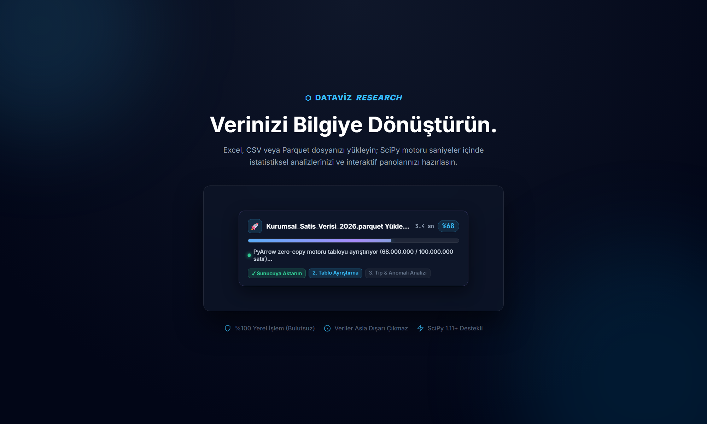
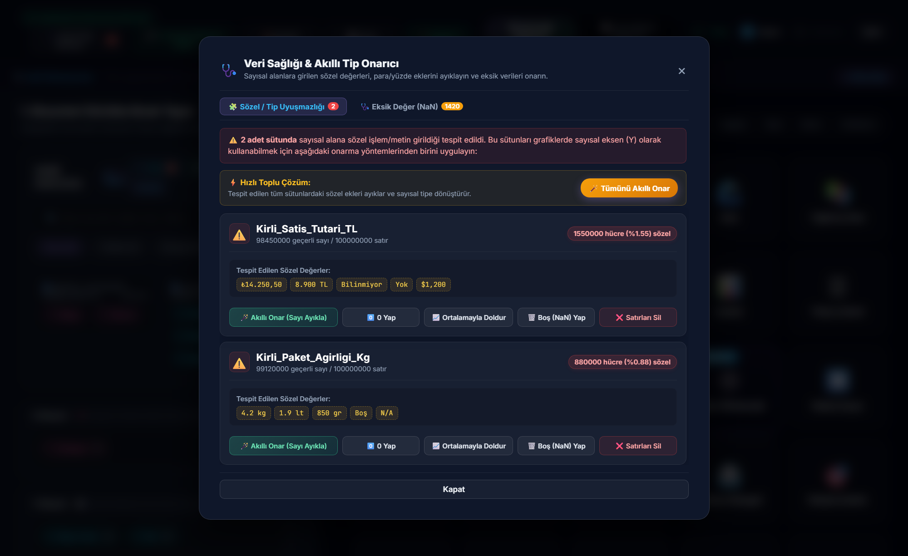
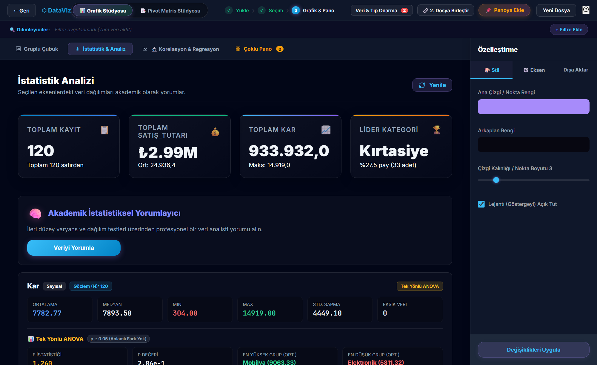
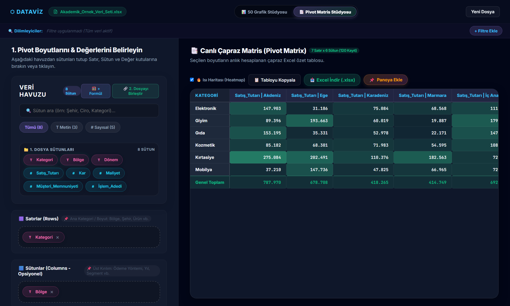

<div align="center">

# 📊 DataViz — Büyük Veri, Görselleştirme ve İstatistik Analiz Stüdyosu

**100 Milyon+ Satırlık Veriyi Saniyeler İçinde Yükleyin, Onarın, Görselleştirin ve Raporlayın**

<p align="center">
  Geleneksel tablo yazılımlarının satır sınırlarını ve karmaşık kodlama süreçlerini geride bırakın.<br>
  <strong>DataViz</strong>; Excel (<code>.xlsx</code>), CSV ve Apache Parquet (<code>.parquet</code>) dosyalarınızı sürükleyip bırakarak anında analiz etmenizi sağlayan, <strong>Polars</strong>, <strong>PyArrow</strong> ve <strong>SciPy</strong> tabanlı yeni nesil bir kurumsal BI ve bilimsel istatistik platformudur.<br><br>
  PyArrow <em>Zero-Copy</em> bellek mimarisi, sütun izdüşümü (<em>Column Projection</em>) ve vektörize <strong>Data Healer</strong> motoru sayesinde <strong>10M – 100M+ satırlık</strong> devasa veri setlerini saniyeler içinde işler. Tüm analizler <strong>%100 yerel bilgisayarınızda</strong> çalışır — verileriniz asla buluta veya üçüncü parti sunuculara gönderilmez.
</p>

<p align="center">
  
  
  
  
  
  
  
</p>

</div>

---

## 🖼️ Ekran Görüntüleri (v3.1 Güncel Sürüm)

### 1. Karşılama Ekranı ve Canlı İstatistik Önizlemesi
<p align="center">
  
</p>

### 2. Aşamalı Canlı Yükleme & İşlem Çubuğu (`DataVizProgress`)
> Dosya yükleme, PyArrow tablo ayrıştırma, veri sağlığı taraması ve sütun onarımı sırasında adım adım ilerleme yüzdesini (`%`), aktif aşamayı ve geçen süreyi canlı gösterir.
<p align="center">
  
</p>

### 3. Veri Sağlığı & Akıllı Tip Onarıcı (`Data Healer`)
> Sayısal sütunlara karışmış `₺14.250,50`, `4.2 kg`, `1.9 lt`, `Bilinmiyor`, `Boş`, `Yok` gibi sözel/bozuk hücreleri otomatik tespit eder ve 100 milyon satırlık veri setlerinde bile tek tıkla sayısal tipe onarır.
<p align="center">
  
</p>

### 4. Sürükle-Bırak Veri Havuzu ve Akıllı Grafik Öneri Motoru (50+ Grafik Türü)
<p align="center">
  
</p>

### 5. İnteraktif Grafik ve Özelleştirme Stüdyosu
<p align="center">
  
</p>

### 6. Yatay İstatistik Kartları, Hipotez Testleri (ANOVA / T-Testi) & Akademik Yorumlayıcı
> Tam genişlikli yatay istatistik kartları ile merkezi eğilim metriklerini, Tek Yönlü ANOVA / T-Testi sonuçlarını ve sadeleştirilmiş yönetici özetini tek bakışta sunar.
<p align="center">
  
</p>

### 7. Bilimsel Korelasyon & Regresyon Laboratuvarı
> Doğrusal, Polinom, Logaritmik ve Üstel regresyon eğrilerini **%95 Güven Aralığı Bandı**, korelasyon ısı haritası matrisi ve sadeleştirilmiş yatay model özeti ile birlikte görselleştirir.
<p align="center">
  
</p>

### 8. Sürükle-Bırak Pivot Matris & Isı Haritası Stüdyosu
<p align="center">
  
</p>

---

## 🎯 DataViz Nedir ve Nasıl Çalışır?

DataViz, teknik veya kodlama bilgisi gerektirmeden **3 basit adımda** uçtan uca veri analizi yapmanızı sağlar:

```text
┌────────────────────────────────────────────────────────────────────────────┐
│                                                                            │
│  1️⃣ YÜKLE & ONAR          2️⃣ YAPILANDIR & KEŞFET       3️⃣ ANALİZ & RAPORLA │
│                                                                            │
│  • CSV / Excel / Parquet  • Sütunları X/Y Eksenine     • 50+ İnteraktif    │
│    dosyanızı bırakın        sürükleyip bırakın           Grafik & Çoklu    │
│  • Canlı aşamalı bar ile  • Akıllı Öneri Motoru en       Pano (Dashboard)  │
│    ilerlemeyi izleyin       uygun grafikleri önerir    • Yatay İstatistik  │
│  • Data Healer ile bozuk  • Dinamik Dilimleyiciler       Kartları, ANOVA,  │
│    birim/para değerlerini   ve Formül Sihirbazı          T-Testi, Regresyon│
│    tek tıkla onarın                                    • A4 PDF & Parquet  │
│                                                                            │
└────────────────────────────────────────────────────────────────────────────┘
```

---

## ✨ Temel Özellikler

| Modül | Özellik | Ne İşe Yarar? |
|---|---|---|
| 🚀 **Büyük Veri Motoru** | **Polars + PyArrow Zero-Copy & Sütun İzdüşümü** | 5 GB'a kadar dosya yükleme desteği; PyArrow zero-copy ile **100M satırı ~62 saniyede** yükler. Yalnızca seçili X/Y sütunlarını işleyerek belleği optimize eder. |
| ⚡ **Aşamalı İlerleme Barı** | **Canlı İşlem Takibi (`DataVizProgress`)** | Veri yükleme, tip onarımı, grafik çizimi ve regresyon hesaplamalarında canlı yüzde (`%`), aktif alt aşama rozetleri ve geçen süre sayacı sunar. |
| 🩺 **Data Healer** | **Akıllı Veri ve Tip Onarıcı** | Sayısal sütunlara karışmış `₺5.200`, `1.250.000`, `120kg`, `1.9 lt`, `%85`, `Boş`, `Yok`, `N/A` gibi ifadeleri tespit eder ve tek geçişli NumPy lookup ile anında sayısal tipe dönüştürür. |
| 📊 **Grafik Stüdyosu** | **50+ İnteraktif Plotly.js Grafiği** | Çubuk, Çizgi, Alan, Dağılım (Scatter), Kutu (Box), Keman (Violin), Halter (Dumbbell), Lolipop, Kadran (Gauge), Radyal Çubuk, Sunburst, Treemap, 3D Yüzey ve Finans (Mum/OHLC) grafikleri. |
| 📈 **İstatistik Laboratuvarı** | **Yatay İstatistik Kartları & Hipotez Testleri** | Tek Yönlü ANOVA ($F$-testi), Bağımsız Örneklem T-Testi ($p$-değeri), çeyreklikler (IQR), standart sapma ve sadeleştirilmiş Akademik Yorumlayıcı. |
| 🔬 **Regresyon Stüdyosu** | **Korelasyon & Regresyon Analizi** | Pearson ($r$), Spearman ($\rho$) ve Kendall ($\tau$) korelasyon matrisi; Doğrusal, Polinom (2. ve 3. derece), Logaritmik ve Üstel regresyon modelleri + **%95 Güven Aralığı Bandı**. |
| 🔀 **Pivot Stüdyosu** | **Dinamik Matris & Isı Haritası** | Excel benzeri sürükle-bırak Satır/Sütun/Değer pivot tablo oluşturucu, koşullu ısı haritası (Heatmap) renklendirmesi ve tek tıkla Excel çıktısı. |
| 🧮 **Formül Sihirbazı** | **Hesaplanmış Sütunlar** | Mevcut sütunlar arasında dört işlem (`+`, `-`, `*`, `/`) veya sabit katsayı (ör. KDV hesaplama) ile anında yeni sütunlar üretir. |
| 🔗 **Veri Birleştirme** | **Çoklu Tablo Birleştirme (SQL Join)** | İkinci bir Excel/CSV/Parquet dosyasını ortak anahtar sütun üzerinden `Inner`, `Left`, `Right` veya `Outer` Join ile ana veriye bağlar. |
| 📄 **A4 PDF & Dışa Aktarma** | **Kurumsal Raporlama** | Panoya sabitlenen (Pin) grafikleri ve yönetici özetlerini sayfa bölünme korumalı **A4 PDF** raporuna dönüştürür; veriyi `.parquet`, `.xlsx` veya `.csv` olarak indirir. |

---

## ⚡ Hızlı Başlangıç (Kurulum)

### Seçenek 1: Windows'ta Tek Tıkla Başlatma (Önerilen)

Proje ana dizinindeki [`DEMO_BASLAT.bat`](DEMO_BASLAT.bat) dosyasına çift tıklayın. Sunucu otomatik olarak başlayacak ve tarayıcınızda `http://127.0.0.1:5000` adresini açacaktır.

### Seçenek 2: Terminal / Manuel Kurulum

```bash
# 1. Depoyu klonlayın ve klasöre girin
git clone https://github.com/UmutcaNN00/dataviz.git
cd dataviz

# 2. Sanal ortam oluşturun ve bağımlılıkları yükleyin (uv veya pip ile)
pip install -r requirements.txt

# 3. Uygulamayı başlatın
python app.py

# 4. Tarayıcınızda açın:
# http://127.0.0.1:5000
```

### Seçenek 3: Docker ile Çalıştırma

```bash
docker compose up -d --build
# Tarayıcıda: http://localhost:5000
```

---

## 🏗️ Proje Mimarisi

```text
dataviz/
│
├── app.py                          # Flask uygulama giriş noktası ve JSON serileştirici (NaN/Inf korumalı)
├── requirements.txt                # Python bağımlılıkları (Flask, Polars, PyArrow, SciPy, Pandas, NumPy)
├── DEMO_BASLAT.bat                 # Windows için tek tıkla başlatıcı
├── Dockerfile                      # Docker konteyner tanımı
├── docker-compose.yml              # Docker Compose servis yapılandırması
├── test_system_connectivity.py     # 19 adımlı uçtan uca (E2E) entegrasyon test paketi
├── generate_100m_dataset.py        # 100M satır × 22 sütun gerçekçi kirli Parquet veri seti üreteci
│
├── core/                           # Çekirdek Yapılandırma ve Bellek Yönetimi
│   ├── config.py                   # Yükleme limitleri (5 GB), izin verilen uzantılar ve dizin ayarları
│   └── store.py                    # Oturum (Session) bazlı LRU bellek içi veri deposu ve GC yönetimi
│
├── routes/                         # Modüler Flask Blueprint Uç Noktaları
│   ├── main_routes.py              # GET / (Karşılama), /analysis (Stüdyo), /health, POST /load_sample
│   ├── upload_routes.py            # POST /upload (CSV/Excel/Parquet), /switch_sheet
│   ├── data_routes.py              # /check_health, /repair_column_anomalies, /clean_data, /merge_datasets
│   ├── chart_routes.py             # POST /get_chart_data (Sütun izdüşümlü), /get_column_unique_values
│   ├── stats_routes.py             # /get_stats, /get_kpi_summary, /get_correlation_matrix, /get_regression_studio_data
│   └── export_routes.py            # /export_data (CSV/Excel/Parquet), /export_pivot_excel
│
├── services/                       # İş Mantığı ve Veri İşleme Katmanı
│   ├── file_service.py             # Polars/PyArrow destekli hızlı dosya okuma ve tip optimizasyonu
│   ├── data_healer.py              # Bozuk sayısal sütun tespiti, birim/para birimi temizleme ve NaN onarımı
│   ├── stats_service.py            # SciPy tabanlı ANOVA, T-Testi, Korelasyon, Regresyon (%95 CI) ve Pivot motoru
│   ├── ai_service.py               # İstatistiksel bulguları sade ve anlaşılır yönetici diline çeviren yorumlayıcı
│   └── export_service.py           # Polars/PyArrow hızlandırmalı Parquet, Excel ve CSV dışa aktarma servisi
│
├── static/                         # İstemci (Frontend) Dosyaları
│   ├── css/
│   │   ├── landing.css             # Karşılama sayfası stilleri
│   │   └── analysis.css            # Analiz stüdyosu, yatay istatistik kartları ve aşamalı yükleme barı stilleri
│   └── js/
│       ├── app.js                  # Ana uygulama koordinatörü, XHR yükleme takibi ve kısayol yöneticisi
│       └── modules/
│           ├── globals.js          # Paylaşılan uygulama durumu (State) ve DataVizProgress yükleme barı motoru
│           ├── charts_config.js    # 50+ Plotly grafik şablonu ve drawMegaPlotly() çizim motoru
│           ├── chart_manager.js    # Sürükle-bırak eksen havuzu, yatay istatistik kartları ve öneri motoru
│           ├── dashboard_studio.js # KPI kartları, Çoklu Pano (Dashboard Grid) ve sabitlenen grafikler
│           ├── data_prep.js        # Data Healer arayüzü, tip onarımı ve eksik veri temizleme modalı
│           ├── pivot_studio.js     # Sürükle-bırak Pivot Matris Stüdyosu
│           ├── regression_studio.js# Korelasyon matrisi ve Regresyon Stüdyosu kontrolcüsü
│           ├── join_modal.js       # İkinci dosya önizleme ve SQL Join birleştirme modalı
│           └── pdf_studio.js       # Etkileşimli A4 PDF Rapor Stüdyosu
│
├── templates/                      # HTML Şablonları
│   ├── landing.html                # Karşılama ve canlı istatistik tanıtım sayfası
│   └── analysis.html               # 3 adımlı ana Analiz Stüdyosu
│
└── docs/images/                    # Güncel uygulama ekran görüntüleri (8 adet)
```

---

## 🩺 Akıllı Veri Onarıcı (Data Healer) Neleri Düzeltebilir?

Ham Excel, CSV veya Parquet dosyalarındaki kirli verileri analiz öncesinde otomatik olarak temizler:

| Bozuk Veri Türü | Ham Örnek | Onarım Sonrası |
|---|---|---|
| **Para Birimi & Semboller** | `₺14.250,50`, `$1,250.50`, `€800`, `8.900 TL` | `14250.5`, `1250.5`, `800.0`, `8900.0` |
| **Ağırlık, Hacim & Ölçü Birimleri** | `4.2 kg`, `1.9 lt`, `850 gr`, `45 adet`, `300m²` | `4.2`, `1.9`, `850.0`, `45.0`, `300.0` |
| **Binlik ve Ondalık Ayraçlar** | `1.250.000` veya `1.250,75` | `1250000.0` / `1250.75` |
| **Yüzde İfadeleri** | `%85`, `42%` | `85.0`, `42.0` |
| **Sözel Eksik Değerler** | `Boş`, `Yok`, `Bilinmiyor`, `Belirtilmemiş`, `N/A`, `-` | `NaN` (Ortalama/Medyan/Sıfır ile anında ikame edilir) |

---

## 🧪 Test Paketi

Tüm backend uç noktalarının ve modüller arası veri sözleşmelerinin sağlamlığını doğrulamak için 19 adımlı entegrasyon test paketini çalıştırabilirsiniz:

```bash
python test_system_connectivity.py
```

---

## 🏎️ Performans Benchmark: 100 Milyon Satır

DataViz, PyArrow zero-copy ve tek geçişli kategorik NumPy indeksleme ile devasa veri setlerini verimli biçimde işler:

| Metrik | Değer |
|---|---|
| **Veri Seti** | 100.000.000 satır × 22 sütun (2.2 milyar hücre) |
| **Parquet Boyutu** | 4.20 GB (ZSTD sıkıştırma) |
| **Yükleme Süresi** | ~62.5 saniye |
| **RAM Kullanımı** | ~6.35 GB |
| **Data Healer Sütun Onarımı** | 10M satır kategorik sütun onarımı: **~0.09 saniye** (`float32` NumPy lookup) |

> 💡 [`generate_100m_dataset.py`](generate_100m_dataset.py) betiği ile kendi 100M satırlık test veri setinizi üretebilirsiniz.

---

## 🔒 Gizlilik & Sistem Gereksinimleri

- **%100 Yerel Mimari:** Yüklediğiniz hiçbir veri seti internet üzerinden herhangi bir sunucuya gönderilmez.
- **Python Sürümü:** Python `3.10+`
- **Önerilen Bellek (RAM):** Standart dosyalar için 4 GB RAM; 10M–100M+ satırlık `.parquet` dosyaları için 8–16 GB RAM önerilir.

---

## 📜 Lisans

Bu proje **MIT Lisansı** altında lisanslanmıştır.

<div align="center">
  <br>
  <b>Geliştirici:</b> <a href="https://github.com/UmutcaNN00">Umutcan</a> &copy; 2026 — <b>DataViz Analiz Stüdyosu</b><br>
  <i>Polars ⚡ + PyArrow 🏹 + SciPy 🔬 + Plotly.js 📊 ile güçlendirilmiştir.</i>
</div>
