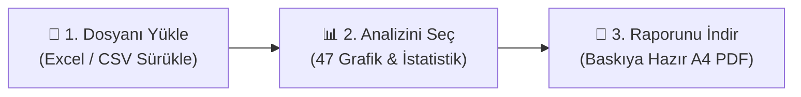

<div align="center">

# ⬡ DataViz Pro
### Excel ve CSV Dosyalarınızı 3 Adımda Etkileşimli Grafikler ve Profesyonel Raporlara Dönüştürün

<p align="center">
  <strong>Karmaşık formüllerle, pahalı yazılım lisanslarıyla veya teknik istatistik jargonuyla uğraşmayın.<br>
  Verinizi sürükleyip bırakın; 47 farklı interaktif grafikle keşfedin, bilimsel testleri tek tıkla çalıştırın ve baskıya hazır A4 PDF raporunuzu saniyeler içinde indirin.</strong>
</p>

<!-- Statü ve Rozetler -->
<p align="center">
  
  
  
  
</p>

<p align="center">
  
  
  
  
  
  
  
</p>

<br>

<!-- Arayüz Önizleme Görseli -->


<br><br>

> 🔒 **%100 Yerel ve Güvenli:** Verileriniz asla yabancı bir buluta yüklenmez. Tüm hesaplamalar kendi bilgisayarınızda milisaniyeler içinde yapılır. Ağır yapay zeka (GPU) donanımı veya API ücreti gerektirmez.

</div>

---

## 🧭 İçindekiler
- [Bu Proje Ne İşe Yarar? (Kısaca)](#-bu-proje-ne-işe-yarar-kısaca)
- [3 Adımda Nasıl Çalışır?](#-3-adımda-nasıl-çalışır)
- [Öne Çıkan Özellikler](#-öne-çıkan-özellikler)
- [Hızlı Başlangıç (1 Dakikada Çalıştırın)](#-hızlı-başlangıç-1-dakikada-çalıştırın)
- [Mimarisi & Klasör Yapısı](#-mimarisi--klasör-yapısı)
- [REST API Uç Noktaları](#-rest-api-uç-noktaları)
- [Teknoloji Yığını](#-teknoloji-yığını)
- [Geliştirici & Lisans](#-geliştirici--lisans)

---

## 🎯 Bu Proje Ne İşe Yarar? (Kısaca)

Elinizde bir Excel veya CSV tablosu var ama ne grafik çizeceğinizi, verideki eğilimleri nasıl bulacağınızı veya bunu yöneticinize/hocanıza nasıl sunacağınızı bilmiyor musunuz?

**DataViz Pro**, tam olarak bu zahmeti ortadan kaldırır:
1. **Düşünmenize gerek bırakmaz:** Sütunlarınızı seçtiğiniz anda verinin türüne (tarih, metin, sayı) göre en uygun grafikleri kendisi önerir.
2. **Akademik istatistiği herkesin anlayacağı dile döker:** Gruplar arasındaki farkın şans eseri mi yoksa gerçek mi olduğunu (ANOVA, T-Testi, Regresyon) hesaplar ve Türkçe cümlelerle açıklar.
3. **Kes-yapıştır yapmadan rapor üretir:** Grafikleri sıralayabileceğiniz, aralarına kendi yorumlarınızı yazabileceğiniz bir A4 stüdyosu sunar; tek tıkla çok sayfalı PDF verir.

---

## ⚡ 3 Adımda Nasıl Çalışır?



| Adım | Ne Yaparsınız? | Ne Kazanırsınız? |
|:---:|:---|:---|
| **1️⃣ Yükle** | `.xlsx`, `.xls` veya `.csv` dosyanızı sürükleyip bırakın (veya tek tıkla hazır örnek veriyi açın). | Başlıklar, sekmeler ve veri tipleri otomatik algılanır. Kodlama veya ayar gerekmez. |
| **2️⃣ Keşfet** | İncelemek istediğiniz sütunları sürükleyin; sistemin önerdiği grafiğe tıklayın. | Trendleri, dağılımları ve korelasyonları anında görün. İstatistik sekmesinde ANOVA/T-test sonuçlarına ulaşın. |
| **3️⃣ Raporla** | Beğendiğiniz grafikleri panoya ekleyin; A4 stüdyosunda yorumlarınızı yazıp indirin. | Saatlerce slayt hazırlamak yerine doğrudan toplantıya veya ödeve uygun PDF çıktısı alın. |

---

## ✨ Öne Çıkan Özellikler

### 📊 1. 47 İnteraktif Grafik & Akıllı Öneri Motoru
* **Akıllı Rozetler:** Seçilen sütunlara göre (örneğin Tarih + Sayısal kolon seçildiğinde Trend grafikleri; Metin + Sayısal seçildiğinde Karşılaştırma grafikleri) en uygun grafik türlerini ışıldayan rozetlerle tavsiye eder.
* **Zengin Görsel Kütüphanesi:**
  * **Trend:** Çizgi, Yumuşak Çizgi (Spline), Basamak, Alan, Yığılmış Alan, Şelale (Waterfall), Finansal Mum (Candlestick), OHLC
  * **Karşılaştırma:** Çubuk, Yatay Çubuk, Gruplu Çubuk, Yığılmış Çubuk, Huni (Funnel), Radar, Nokta Kıyas (Dotplot), Bullet (KPI)
  * **Dağılım:** Histogram, 2D Histogram, Kutu (Box Plot), Keman (Violin), Şerit (Strip), Halı (Rug), 2D Yoğunluk, Hata Çubukları (Errorbar)
  * **İlişki & Matris:** Dağılım (Scatter), Balon (Bubble), Scatter Matrix (SPLOM), Isı Haritası (Heatmap), Paralel Koordinatlar (Parcoords), Paralel Kategoriler (Parcats)
  * **Parça-Bütün:** Pasta, Donut, Sunburst, Ağaç (Treemap), Funnel Area, Sarkıt (Icicle), Akış (Sankey)
  * **3D & Bilimsel:** 3D Scatter, 3D Çizgi, 3D Yüzey (Surface), Kontur, Polar Çubuk, Polar Scatter, Rüzgar Gülü (Windrose), Üçgen (Ternary), Halı (Carpet), Dünya Haritası (Scattergeo)

### 🔬 2. Anlaşılır Akademik İstatistik Laboratuvarı
* **Şans mı, Gerçek Fark mı? (ANOVA & T-Testi):** İki veya daha fazla grup (ör. Şube A ve Şube B satışları) arasındaki farkın tesadüf olup olmadığını SciPy motoruyla kuramsal olarak test eder ($F$ ve $t$ istatistikleri, $p$-değeri).
* **Doğrusal İlişki & Regresyon:** Sayısal iki değişken arasındaki bağı korelasyon katsayısı ($r$), belirlilik katsayısı ($R^2$) ve açık matematiksel denklemle ($y = mx + c$) gösterir.
* **Akademik Özet:** İstatistiksel bulguları, araştırmacıların ve karar vericilerin doğrudan kullanabileceği akademik bir dille otomatik özetler.

### 📄 3. Etkileşimli A4 PDF Rapor Stüdyosu
* **Birebir A4 Önizleme:** Grafikler ve üst düzey KPI kartları A4 tuvalinde sıralanır.
* **Sırala & Çıkar:** Rapor bloklarını `↑` ve `↓` butonlarıyla yukarı-aşağı taşıyabilir, istemediğiniz grafikleri tek tıkla silebilirsiniz.
* **Serbest Yönetici Notları:** `+ Metin Ekle` butonuyla grafiklerin arasına kendi yorum ve analizlerinizi doğrudan yazabilirsiniz.
* **Akıllı Sayfalama:** `html2pdf.js` motoru sayesinde grafikleri ortadan ikiye bölmeden temiz, çok sayfalı kurumsal PDF üretir.

### 🛠 4. Pratik Veri Hazırlama & Formül Sihirbazı
* **Çoklu Sekme (Multi-Sheet):** Excel kitaplarındaki farklı sayfalar arasında anında geçiş.
* **Tablo Birleştirme (Join/Merge):** İki bağımsız Excel/CSV tablosunu ortak bir anahtar sütun üzerinden (`Left`, `Right`, `Inner`, `Outer`) eşleştirip tek tabloda birleştirme.
* **Formül Sihirbazı:** Dört işlemle (`+`, `-`, `*`, `/`) veya sabit katsayıyla saniyeler içinde yeni hesaplanmış sütunlar türetme (sıfıra bölünme korumalı).
* **Veri Temizleme:** Eksik hücreleri (NaN) tek tıkla ortalama veya sıfırla doldurma, ya da boş satırları ayıklama.
* **Canlı Dilimleyiciler (Slicers):** Metin seçimleri veya sayısal aralık kaydırıcılarıyla tüm analizleri anlık filtreleme.

---

## 🚀 Hızlı Başlangıç (1 Dakikada Çalıştırın)

Sisteminizde **Python 3.10 veya üzeri** bir sürümün kurulu olması yeterlidir.

### Seçenek 1: 🪟 Windows İçin Tek Tıkla Başlatıcı (Önerilen)
Komut satırıyla uğraşmak istemiyorsanız:
1. Projeyi indirin veya klonlayın.
2. Klasördeki **`DEMO_BASLAT.bat`** dosyasına çift tıklayın.
3. Sunucu otomatik başlar ve varsayılan tarayıcınızda `http://127.0.0.1:5000` açılır!

---

### Seçenek 2: ⚡ `uv` ile Hızlı Başlatma (Geliştiriciler İçin)
Modern ve ultra hızlı paket yöneticisi **uv** ile:
```bash
# Repoyu klonlayın
git clone https://github.com/UmutcaNN00/dataviz.git
cd dataviz

# Çalıştırın (bağımlılıkları otomatik çözer)
uv run python app.py
```
Tarayıcınızda **`http://127.0.0.1:5000`** adresine gidin.

---

### Seçenek 3: Standart `pip` ile Kurulum
```bash
git clone https://github.com/UmutcaNN00/dataviz.git
cd dataviz

python -m venv .venv
source .venv/bin/activate    # Windows için: .venv\Scripts\activate
pip install -r requirements.txt
python app.py
```

---

## 📂 Mimarisi & Klasör Yapısı

```text
dataviz/
├── app.py                      # Flask backend, veri motoru ve REST API servisleri
├── requirements.txt            # Çekirdek Python bağımlılıkları (flask, pandas, openpyxl, scipy)
├── DEMO_BASLAT.bat             # Windows tek tıkla otomatik başlatıcı
├── README.md                   # Kapsamlı ve doğrulanmış proje dokümantasyonu
├── templates/
│   ├── landing.html            # Açılış ve karşılama vitrini
│   ├── analysis.html           # 3 adımlı ana analiz laboratuvarı ve PDF stüdyosu
│   └── a4_demo.html            # A4 PDF Stüdyosu etkileşimli simülatörü
└── static/
    ├── css/
    │   ├── analysis.css        # Analiz arayüzü, cam efekti (glassmorphism) stilleri
    │   ├── landing.css         # Açılış sayfası düzeni ve tipografi
    │   └── style.css           # Global değişkenler ve yardımcı sınıflar
    ├── js/
    │   ├── app.js              # Kural motoru, Plotly çizicileri ve PDF üretim mantığı
    │   ├── landing.js          # Açılış sayfası etkileşimleri
    │   ├── three_scene.js      # Three.js interaktif 3D arka plan
    │   └── modules/
    │       ├── charts_config.js # 47 grafik türünün meta-veri tanımları
    │       └── globals.js       # Reaktif durum yönetimi (State)
    └── img/
        └── dataviz_pro_linkedin.jpg # Ürün tanıtım ve vitrin görseli
```

---

## 🔌 REST API Uç Noktaları

| Uç Nokta | Metot | Açıklama |
|---|---|---|
| `/` | `GET` | Tanıtım ve karşılama sayfasını görüntüler. |
| `/analysis` | `GET` | 3 adımlı ana analiz laboratuvarını açar. |
| `/a4-demo` | `GET` | A4 PDF Stüdyosu bağımsız önizleme simülatörünü açar. |
| `/load_sample` | `POST` | Tek tıkla analiz için hazır örnek veri setini yükler. |
| `/upload` | `POST` | Excel (`.xlsx`, `.xls`) ve CSV dosyalarını yükler, başlık ve tipleri ayrıştırır. |
| `/switch_sheet` | `POST` | Excel çalışma kitabındaki aktif sayfayı değiştirir. |
| `/preview_second_file` | `POST` | Birleştirilecek (Merge/Join) 2. dosyanın eşleşme anahtarlarını tarar. |
| `/merge_datasets` | `POST` | İki tabloyu seçilen ortak anahtar üzerinden birleştirir (Left, Right, Inner, Outer). |
| `/create_calculated_column` | `POST` | Dört işlemle yeni türetilmiş sayısal sütun oluşturur. |
| `/check_health` | `GET` | Verideki toplam eksik (NaN) hücre ve satır sayısını raporlar. |
| `/clean_data` | `POST` | Eksik değerleri ortalamayla veya sıfırla doldurur ya da boş satırları siler. |
| `/get_column_details` | `POST` | Dilimleyiciler (Slicers) için sütunların min/max değerlerini ve kategorilerini döner. |
| `/get_kpi_summary` | `POST` | Pano için toplam kayıt, ana toplam ve dağılım KPI kartlarını üretir. |
| `/get_chart_data` | `POST` | Filtrelenmiş veriyle 47 grafik tipine uygun ham veya toplulaştırılmış veri üretir. |
| `/get_stats` | `POST` | ANOVA, T-Testi, Korelasyon, Regresyon ve temel dağılım istatistiklerini hesaplar. |
| `/generate_insight` | `POST` | İstatistiksel verileri bilimsel ve akademik bir yorum metnine dönüştürür. |
| `/export_data` | `POST` | Filtrelenmiş aktif veriyi `.csv` veya `.xlsx` formatında indirir. |

---

## 🛠 Teknoloji Yığını

| Katman | Teknoloji | Görevi |
|---|---|---|
| **Backend & API** | `Python 3.10+`, `Flask 3.0+` | Hafif, donanım dostu ve hızlı REST sunucu mimarisi. |
| **Veri İşleme** | `Pandas 2.0+`, `NumPy` | Tablo filtreleme, birleştirme (merge) ve formül hesaplamaları. |
| **Excel Desteği** | `openpyxl` | Modern `.xlsx` çalışma kitaplarını okuma ve dışa aktarma. |
| **İstatistik Motoru** | `SciPy 1.11+` | ANOVA ($F$), Welch's T-Testi ($t$), Korelasyon ($r$) ve OLS Regresyon. |
| **Görselleştirme** | `Plotly.js 2.27.0` | 47 grafik türünde WebGL hızlandırmalı interaktif çizim. |
| **PDF Raporlama** | `html2pdf.js 0.10.1` | A4 ölçekli, sayfa kesme korumalı kurumsal PDF çıktısı. |
| **Paket Yönetimi** | `Astral uv` / `pip` | Sıfır bekleme süreli sanal ortam ve tek komutla çalıştırma. |

---

## 👨‍💻 Geliştirici & Lisans

Bu proje **Umutcan** ([@UmutcaNN00](https://github.com/UmutcaNN00)) tarafından veri bilimi çalışmaları, akademik sunumlar ve modern iş zekası ihtiyaçları doğrultusunda geliştirilmiştir.

Proje **[MIT Lisansı](LICENSE)** kapsamında açık kaynak olarak sunulmuştur.

<br>

<div align="center">
  <sub>Modern Veri Analitiği için Titizlikle Geliştirildi • <b>DataViz Pro</b> 2026</sub>
</div>
