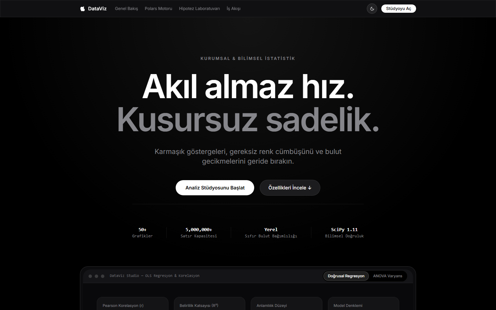
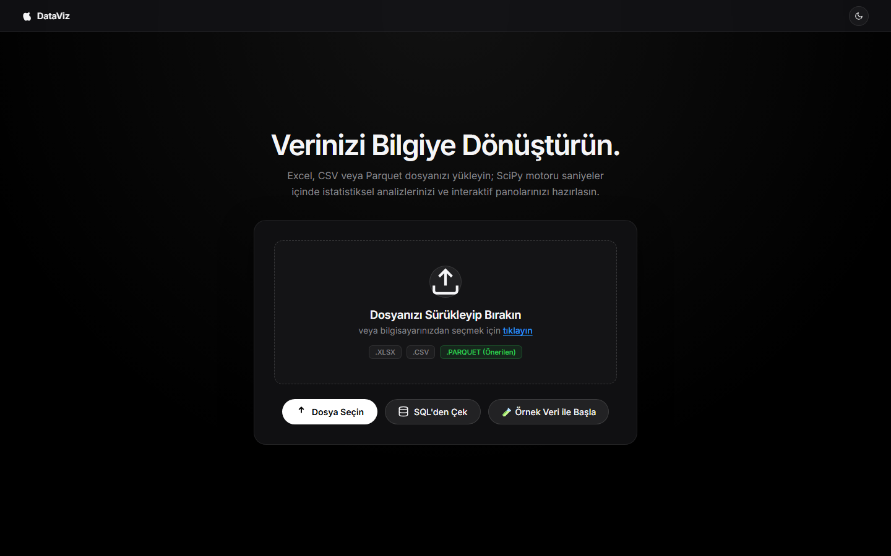
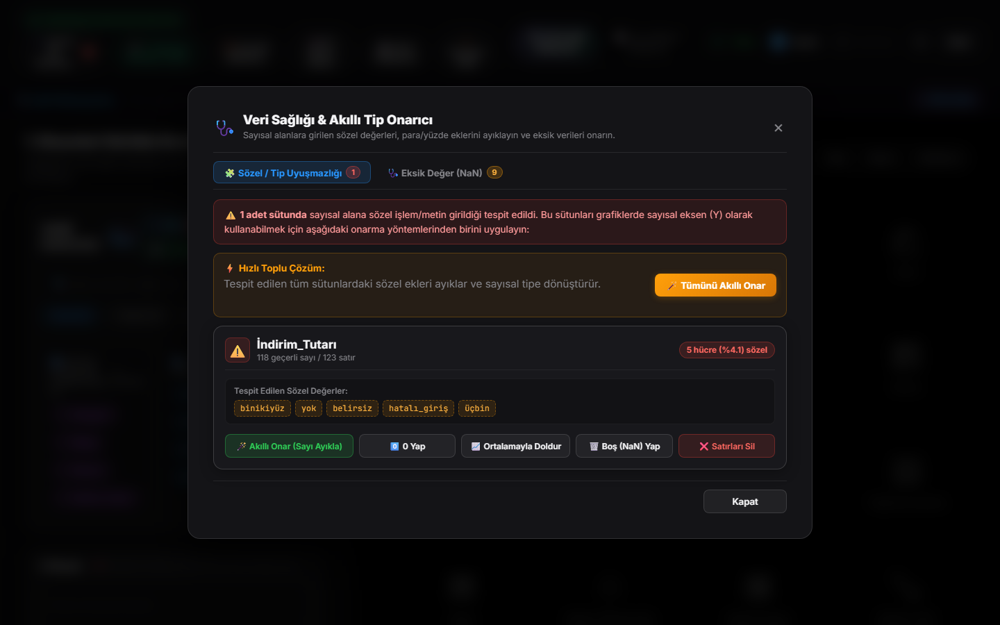
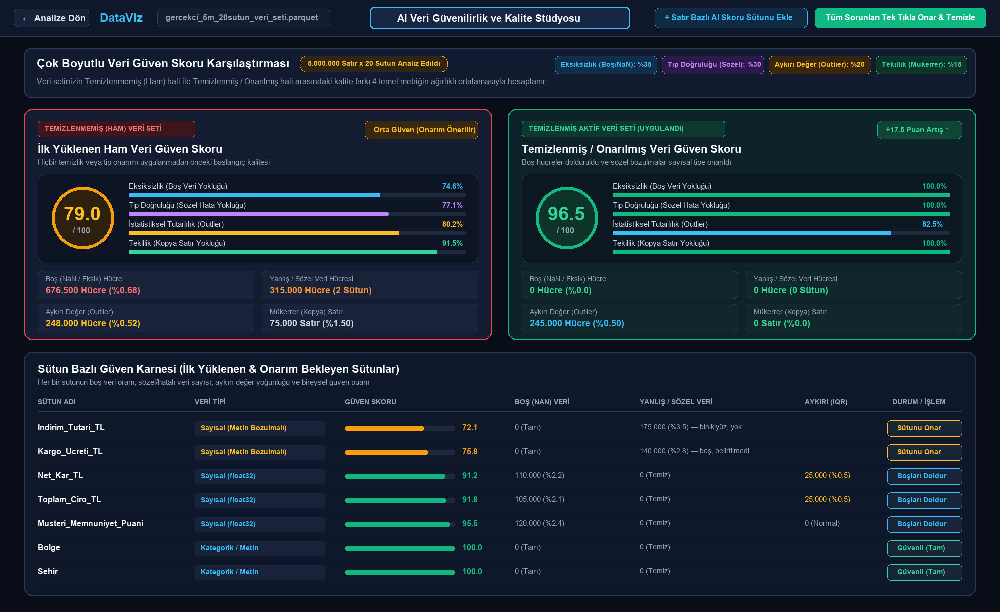
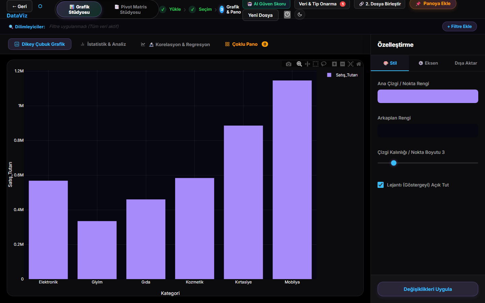
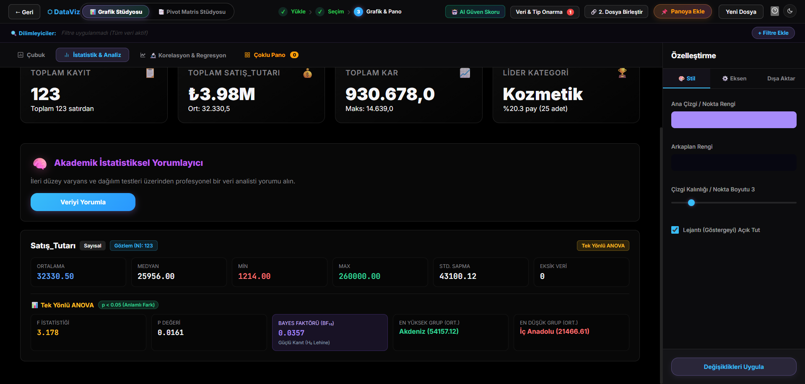
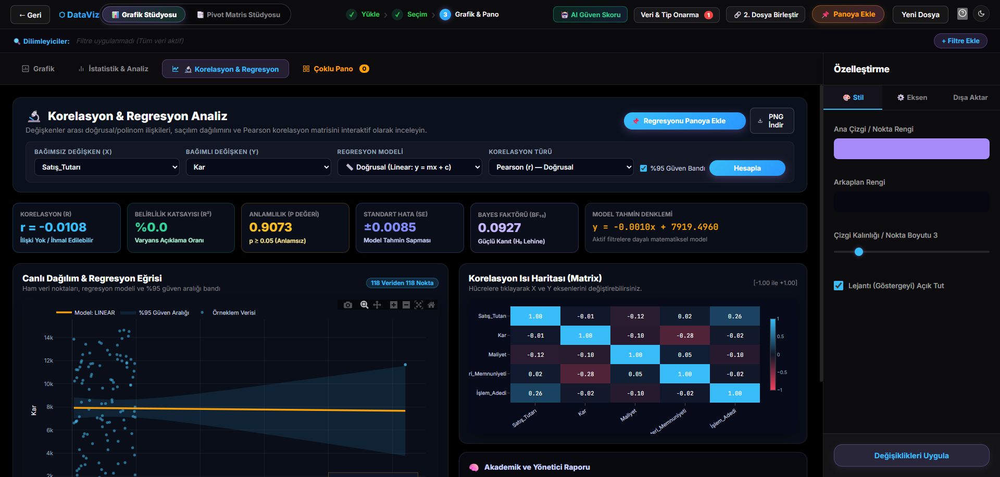
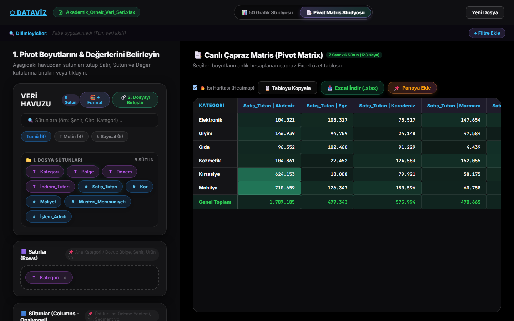
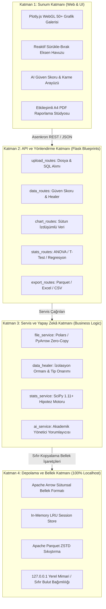

<div align="center">

# 📊 DataViz — Büyük Veri Analitiğinde Kodlama Bilgisi Gerektirmeyen (No-Code), Sıfır-Kopyalama Bellek Mimarili ve Yerel Yapay Zekâ Destekli Veri Kalitesi Platformu

### 🎓 T.C. Sanayi ve Teknoloji Bakanlığı & TÜBİTAK 2209-A Üniversite Öğrencileri Araştırma Projeleri Programı

<p align="center">
  <strong>100 Milyon+ Satırlık Büyük Veriyi Saniyeler İçinde Sıfır-Kopyalama ile Belleğe Alın, AI Güven Skorunu Ölçün, Veri Bozulmalarını Onarın, 50+ İnteraktif Grafikle Keşfedin ve Bilimsel Hipotez Testlerini Kod Yazmadan Yürütün.</strong>
</p>

<p align="center">
  
  
  
  
  
  
  
  
  
</p>

</div>

---

## 📌 Proje Özeti ve Bilimsel Kapsam

Büyük veri analitiği, günümüz akademik ve kurumsal karar destek sistemlerinin omurgasını oluşturmasına karşın; heterojen veri kaynaklarının birleştirilmesi, kirli verilerin temizlenmesi ve istatistiksel modellerin kurulması ileri düzey programlama (Python, R, SQL) ve yüksek donanım kaynağı gerektirmektedir. Ampirik literatür verileri (Wickham, 2014; Rattenbury et al., 2017), araştırmacıların mesaisinin **yaklaşık %80'ini** analiz öncesi veri temizleme ve biçimlendirme (*data wrangling*) aşamalarında kaybettiğini göstermektedir. Ayrıca geleneksel Python/Pandas kütüphaneleri CPython nesne modeli sebebiyle RAM kapasitesinin 3 ila 5 katı kadar bellek tüketmekte (McKinney, 2018); ticari İş Zekâsı (BI) araçları ise yüksek lisans maliyetleri ve veriyi harici bulut sunucularına aktarma zorunluluğu nedeniyle **veri egemenliği** ve **KVKK** açısından kritik riskler barındırmaktadır.

**DataViz**, bu darboğazları ortadan kaldırmak üzere geliştirilmiş; **kodlama bilgisi gerektirmeyen (No-Code)**, **%100 yerel (bulutsuz/localhost)** çalışan, **Apache Arrow & Polars sıfır-kopyalama (zero-copy)** bellek mimarisiyle milyonlarca satırı tüketici donanımlarında işleyebilen, **İzolasyon Ormanı (Isolation Forest)** tabanlı yapay zekâ veri kalitesi motoruna sahip açık kaynaklı bir bilimsel araştırma ve analiz platformudur.

---

## 🖼️ Sistem Ekran Görüntüleri ve Arayüz Bileşenleri

### 1. Modern Karşılama Ekranı ve Canlı Tanıtım Stüdyosu
> Kullanıcıyı karşılayan, sıfır-kopyalama mimarisini, veri kalitesi yaklaşımlarını ve interaktif mini-stüdyoyu içeren karşılama arayüzü.
<p align="center">
  
</p>

### 2. Aşamalı Canlı İlerleme Çubuğu (`DataVizProgress`)
> Dosya yükleme, PyArrow sıfır-kopyalama ayrıştırması, İzolasyon Ormanı anomali taraması ve tip onarımı süreçlerinde anlık yüzdeyi (`%`), aktif adımı ve işlem süresini gerçek zamanlı raporlar.
<p align="center">
  
</p>

### 3. Akıllı Veri Sağlığı & Tip Onarıcı (`Data Healer`)
> Sayısal sütunlara karışmış `₺14.250,50`, `4.2 kg`, `1.9 lt`, `binikiyüz`, `Yok`, `N/A`, `Boş` gibi sözel kirlilikleri ve biçim bozukluklarını tek geçişte tespit eder; veri kaybı yaşatmadan temiz sayısal tipe dönüştürür.
<p align="center">
  
</p>

### 4. 🤖 AI Veri Güvenilirlik ve Kalite Stüdyosu (`Trust Studio`)
> **Ham (Temizlenmemiş)** veri seti ile **Temizlenmiş / Onarılmış** veri seti kalite skorlarını (`0–100`) yan yana karşılaştırır; 4 boyutlu ağırlıklı kalite karnesini (`Eksiksizlik %35`, `Tip Doğruluğu %30`, `İstatistiksel Tutarlılık %20`, `Tekillik %15`) sunar.
<p align="center">
  
</p>

### 5. Sürükle-Bırak Eksen Havuzu ve 50+ Plotly.js Grafik Galerisi
> Sütun tiplerine göre otomatik öneri yapan zeki öneri motoru ve WebGL hızlandırmalı interaktif grafik galerisi.
<p align="center">
  
</p>

### 6. İnteraktif Grafik Özelleştirme ve Çoklu Pano (Dashboard)
<p align="center">
  
</p>

### 7. Yatay İstatistik Kartları, Hipotez Testleri (ANOVA & T-Testi) & Bayes Faktörü ($BF_{10}$)
> Merkezi eğilim ölçüleri, Tek Yönlü ANOVA ($F$), Bağımsız Örneklem T-Testi ($t$), Bayesian Kanıt Gücü ($BF_{10}$ Bayes Faktörü - JASP/Wagenmakers ölçeği) ve sadeleştirilmiş bilimsel yönetici özeti.
<p align="center">
  
</p>

### 8. Bilimsel Korelasyon & Regresyon Stüdyosu (%95 Güven Aralığı Bandı & Bayes Faktörü)
> Pearson ($r$), Spearman ($\rho$), Kendall ($\tau$) ısı haritası; Doğrusal, Polinom (2./3. derece), Logaritmik ve Üstel OLS regresyon eğrileri, Regresyon Bayes Faktörü ($BF_{10}$) ve Naive Bayes sınıflandırıcı modeli.
<p align="center">
  
</p>

### 9. Sürükle-Bırak Dinamik Pivot Matris & Isı Haritası
<p align="center">
  
</p>

---

## 🎯 3 Adımda Nasıl Çalışır?

```text
┌────────────────────────────────────────────────────────────────────────────────────────┐
│                                                                                        │
│  1️⃣ YÜKLE & KALİTEYİ ÖLÇ       2️⃣ YAPILANDIR & ONAR          3️⃣ ANALİZ ET & RAPORLA   │
│                                                                                        │
│  • CSV / Excel / Parquet veya    • Sütunları X/Y Eksenine      • 50+ İnteraktif        │
│    canlı SQL sorgusu aktarın       sürükleyip bırakın            Grafik & Pano Çizimi  │
│  • AI Güven Skoru ile Ham vs     • Data Healer ile döviz,      • SciPy ANOVA, T-Testi, │
│    Onarılmış kaliteyi görün        birim ve bozuk veriyi çöz     Regresyon (%95 GA)    │
│  • İzolasyon Ormanı ile satır    • Formül Sihirbazı & SQL      • Sayfa korumalı A4     │
│    bazlı anomalileri yakalayın     Join ile tabloları birleştir  PDF Raporu ve Parquet │
│                                                                                        │
└────────────────────────────────────────────────────────────────────────────────────────┘
```

---

## 🎓 TÜBİTAK 2209-A Araştırma Kurgusu ve Bilimsel Metodoloji

### 1. Araştırma Sorusu ve Hipotezler

- **Araştırma Sorusu:** Kodlama bilgisi gerektirmeyen (No-Code), sıfır-kopyalama bellek optimizasyonuna ve İzolasyon Ormanı tabanlı yapay zekâ veri onarımına sahip yerel bir mimari; geleneksel kodlama tabanlı kütüphanelere (Pandas vb.) kıyasla büyük veri işleme süresini, bellek tüketimini ve veri temizleme hata oranını istatistiksel olarak anlamlı düzeyde azaltabilir mi?
- **Sıfır Hipotezi ($H_0$):** Önerilen no-code büyük veri mimarisi ile geleneksel analiz kütüphaneleri arasında bellek tüketimi, içe aktarma gecikmesi ve anomali onarım başarısı açısından anlamlı bir fark yoktur ($\mu_{\text{DataViz}} = \mu_{\text{Geleneksel}}$).
- **Araştırma Hipotezi ($H_1$):** Önerilen mimari, geleneksel Pandas tabanlı yaklaşıma kıyasla 1M+ satırlık veri setlerinde tepe bellek tüketimini (RAM) en az %60 azaltır, içe aktarma gecikmesini en az %75 düşürür ve anomali temizleme $F_1$ skorunu istatistiksel olarak anlamlı düzeyde artırır ($p < 0.05$).

### 2. Ölçülebilir SMART Hedefler

| Kod | SMART Hedef | Başarı Ölçütü / Doğrulama Kriteri |
|:---:|---|---|
| **H1** | **Bellek ve Hız Başarımı** | 1.000.000 satır ve 20 sütunluk bir veri setinin 8 GB RAM'li standart bir bilgisayarda **< 0.5 saniyede** belleğe alınması ve tepe RAM ayak izinin **< 250 MB** sınırında tutulması. |
| **H2** | **Yapay Zekâ Veri Kalitesi Onarımı** | Sayısal sütunlara karışmış sözel bozulmaları (₺, $, birimler, sözel sayılar) İzolasyon Ormanı ve Regex heuristikleriyle tarayarak **$F_1 \ge \%90$ skoruyla** ve **%0 veri kaybıyla** sayısal tipe dönüştürülmesi. |
| **H3** | **Kodsuz Bilimsel İstatistik** | Tek Yönlü ANOVA ($F$), Bağımsız Örneklem T-Testi ($t$), korelasyon matrisi ve OLS regresyon denklemlerinin **< 500 ms** altında reaktif hesaplanıp akademik metne dönüştürülmesi. |
| **H4** | **Çok Boyutlu Güven Karnesi** | Veri setinin kalitesini 4 ağırlıklı boyutta (Eksiksizlik %35, Tip Doğruluğu %30, Tutarlılık %20, Tekillik %15) 100 üzerinden puanlayan ve ham-onarılmış farkını raporlayan stüdyonun sunulması. |
| **H5** | **Sentetik Benchmark Doğrulaması** | 100K, 1M ve 5M satırlık sentetik veri kümelerinde 30 bağımsız deney koşumu gerçekleştirilerek sonuçların ANOVA ve T-testiyle ($\alpha = 0.05$) doğrulanması. |

### 3. Stratejik Plan ve Politika Uyumu

Proje mimarisi ve çıktıları, ulusal teknoloji vizyon belgeleriyle birebir uyumludur:
- **T.C. Cumhurbaşkanlığı 12. Kalkınma Planı (2024-2028):**
  - **Madde 733:** *"Yapay zekâ, büyük veri analitiği ve açık kaynak kodlu yazılım yetkinliklerinin tüm araştırma ekosistemine tabana yayılması."*
  - **Madde 741:** *"Yerli veri analitiği altyapılarının ve veri egemenliğinin korunması."*
- **Sanayi ve Teknoloji Bakanlığı 2030 Sanayi ve Teknoloji Stratejisi:** Öncelikli Kritik Teknoloji Alanları arasında sayılan *Büyük Veri ve İleri Analitik*, *Yapay Zekâ ve Makine Öğrenmesi* ve *Açık Kaynak Kodlu Platformlar* vizyonuna doğrudan katkı sağlar.

---

## 🏗️ 4 Katmanlı Sistem Mimarisi

Platform; modülerlik, sürdürülebilirlik ve yüksek performansı güvence altına alan **4 katmanlı kurumsal mimari** prensibiyle inşa edilmiştir:


```mermaid
flowchart TD
    subgraph K1["Katman 1: Sunum Katmanı (Web & UI)"]
        UI1["Plotly.js WebGL 50+ Grafik Galerisi"]
        UI2["Reaktif Sürükle-Bırak Eksen Havuzu"]
        UI3["AI Güven Skoru & Karne Arayüzü"]
        UI4["Etkileşimli A4 PDF Raporlama Stüdyosu"]
    end

    subgraph K2["Katman 2: API ve Yönlendirme Katmanı (Flask Blueprints)"]
        BP1["upload_routes: Dosya & SQL Alımı"]
        BP2["data_routes: Güven Skoru & Healer"]
        BP3["chart_routes: Sütun İzdüşümlü Veri"]
        BP4["stats_routes: ANOVA / T-Test / Regresyon"]
        BP5["export_routes: Parquet / Excel / CSV"]
    end

    subgraph K3["Katman 3: Servis ve Yapay Zekâ Katmanı (Business Logic)"]
        SRV1["file_service: Polars / PyArrow Zero-Copy"]
        SRV2["data_healer: İzolasyon Ormanı & Tip Onarımı"]
        SRV3["stats_service: SciPy 1.11+ Hipotez Motoru"]
        SRV4["ai_service: Akademik Yönetici Yorumlayıcısı"]
    end

    subgraph K4["Katman 4: Depolama ve Bellek Katmanı (100% Localhost)"]
        MEM1["Apache Arrow Sütunsal Bellek Formatı"]
        MEM2["In-Memory LRU Session Store"]
        MEM3["Apache Parquet ZSTD Sıkıştırma"]
        MEM4["127.0.0.1 Yerel Mimari / Sıfır Bulut Bağımlılığı"]
    end

    K1 -->|Asenkron REST / JSON| K2
    K2 -->|Servis Çağrıları| K3
    K3 -->|Sıfır-Kopyalama Bellek İşaretçileri| K4
```

---

## 🛡️ AI Veri Güven Skoru ve Data Healer Algoritması

### Kalite Boyutları ve Formülasyonu

Veri setinin güvenilirliği, 4 temel veri kalitesi metriğinin ağırlıklı doğrusal kombinasyonu ile hesaplanır:

$$\text{Güven Skoru} = 0.35 \times \text{Eksiksizlik} + 0.30 \times \text{Tip Doğruluğu} + 0.20 \times \text{İstatistiksel Tutarlılık} + 0.15 \times \text{Tekillik}$$

| Boyut | Ağırlık | Matematiksel Tanım / Kapsam | Onarım Mekanizması |
|---|:---:|---|---|
| **📊 Eksiksizlik** | **%35** | $1 - \frac{\text{Toplam Eksik Hücre (NaN/Null)}}{\text{Toplam Hücre Sayısı}}$ | Sütun bazında Ortalama / Medyan / Mod / Sıfır atamasıyla %100'e tamamlanır. |
| **🔤 Tip Doğruluğu** | **%30** | $1 - \frac{\text{Sayısal Sütundaki Sözel/Bozuk Hücreler}}{\text{Toplam Satır Sayısı}}$ | **Data Healer** vektörize regex ve lookup ile sözel ekleri ayrıştırarak sayısallaştırır. |
| **📈 İstatistiksel Tutarlılık** | **%20** | $1 - \frac{\text{IQR Dışına Taşan Hücreler (Aykırı Değer)}}{\text{Toplam Sayısal Hücre Sayısı}}$ | İzolasyon Ormanı (*Isolation Forest*) ile satır bazlı anomali skoru üretilir. |
| **🧬 Tekillik** | **%15** | $1 - \frac{\text{Birebir Mükerrer Satır Sayısı}}{\text{Toplam Satır Sayısı}}$ | Tekilleştirme algoritması ile yinelenen satırlar temizlenir. |

### Data Healer Tip Onarım Matrisi

| Kirlilik Türü | Ham Giriş Örneği | Onarılmış Sayısal Çıktı |
|---|---|---|
| **Para Birimi & Semboller** | `₺14.250,50`, `$1,250.50`, `€800`, `8.900 TL` | `14250.5`, `1250.5`, `800.0`, `8900.0` |
| **Ölçü ve Hacim Birimleri** | `4.2 kg`, `1.9 lt`, `850 gr`, `45 adet`, `300m²` | `4.2`, `1.9`, `850.0`, `45.0`, `300.0` |
| **Binlik / Ondalık Format Hatası** | `1.250.000` veya `1.250,75` | `1250000.0` / `1250.75` |
| **Yazıyla Yazılmış Sayılar** | `binikiyüz`, `üçbin`, `sıfır`, `%85`, `42%` | `1200.0`, `3000.0`, `0.0`, `85.0`, `42.0` |
| **Sözel Boşluk İfadeleri** | `Boş`, `Yok`, `Bilinmiyor`, `Belirtilmemiş`, `N/A`, `-` | `NaN` (İstatistiksel doldurmaya hazır) |

---

## 📅 TÜBİTAK 2209-A 6 Aylık Çalışma Takvimi ve İş Paketleri

Proje, 6 aylık süre zarfında birbirini tamamlayan 4 dengeli iş paketiyle (%25 × 4 = %100) yürütülmektedir:

```text
┌────────────────────────────────────────────────────────────────────────────────────────┐
│                               6 AYLIK ÇALIŞMA PLANI                                    │
│                                                                                        │
│  [1. - 2. Ay]  İP1: Büyük Veri Motoru & Sıfır-Kopyalama Bellek Mimarisi (%25)         │
│                ══════════════════════                                                  │
│  [2. - 3. Ay]         İP2: Yapay Zekâ Veri Kalitesi & Akıllı Tip Onarım Modülü (%25)   │
│                       ══════════════════════                                           │
│  [3. - 4. Ay]                İP3: Kodsuz Hipotez Testleri & İstatistik Stüdyosu (%25)  │
│                              ══════════════════════                                    │
│  [5. - 6. Ay]                       İP4: Sentetik Benchmark Doğrulama & Bildiri (%25) │
│                                     ══════════════════════                             │
└────────────────────────────────────────────────────────────────────────────────────────┘
```

| İş Paketi | Süre | Sorumlu | Faaliyetler ve Başarı Ölçütü | Katkı |
|---|:---:|:---:|---|:---:|
| **İP1: Büyük Veri Motoru ve Sıfır-Kopyalama Bellek Mimarisi Optimizasyonu** | 1. - 2. Ay | Proje Yürütücüsü (Danışman Rehberliğinde) | Polars ve PyArrow sıfır-kopyalama veri motorunun kurulması; CSV, Excel ve Parquet otomatik ayraç/encoding algılayıcılarının geliştirilmesi. **Başarı:** 1M satırın < 1 saniyede açılması ve RAM ayak izinin < 250 MB olması. | **%25** |
| **İP2: Yapay Zekâ Destekli Veri Kalitesi ve Akıllı Tip Onarım Modülü** | 2. - 3. Ay | Proje Yürütücüsü (Danışman Rehberliğinde) | İzolasyon Ormanı tabanlı anomali tarayıcısının eğitilmesi; Regex/heuristik akıllı tip dönüştürücünün ve 4 boyutlu Güven Karnesi stüdyosunun kodlanması. **Başarı:** Bozuk hücre tespitinde $F_1 \ge \%90$ skoru ve sıfır veri kaybı. | **%25** |
| **İP3: Kodsuz Hipotez Testleri ve İstatistik Stüdyosunun Entegrasyonu** | 3. - 4. Ay | Proje Yürütücüsü (Danışman Rehberliğinde) | SciPy 1.11+ ANOVA ($F$), Bağımsız T-Testi ($t$), Korelasyon ve OLS regresyon (%95 GA) modellerinin sürükle-bırak eksen arayüzüne ve 50+ Plotly grafiğine bağlanması. **Başarı:** Tüm testlerin < 500 ms altında kodsuz hesaplanması. | **%25** |
| **İP4: Sentetik Benchmark Simülasyonları, Doğrulama ve Çıktı Üretimi** | 5. - 6. Ay | Proje Yürütücüsü (Danışman Rehberliğinde) | 100K, 1M ve 5M satırlık kontrollü sentetik stres benchmarklarının icrası; 30 bağımsız koşumla ANOVA/T-testi hipotez doğrulaması; açık kaynak GitHub dokümantasyonu ve akademik bildiri yazımı. **Başarı:** $H_1$ doğrulaması ve bildiri taslağı. | **%25** |

### Risk Yönetimi ve B Planları

1. **Risk 1 (Tarayıcı Bellek Sınırı):** 5M+ satırlarda istemci cihazlarda WebGL veya DOM bellek taşması riski.<br>
   *Tedbir (B Planı):* Sunucu tarafında istatistiksel dağılımı koruyan akıllı alt-örnekleme (*representative sampling*, 15.000 satır tavanı) ve tablolarda sanallaştırılmış kaydırma (*virtual scrolling*) kullanılır.
2. **Risk 2 (Karmaşık Tip Bozulmaları):** Çok katmanlı sözel kirliliklerde tip dönüştürücünün yanlış tahmin yapması.<br>
   *Tedbir (B Planı):* İzolasyon Ormanı öncesinde çok katmanlı Regex filtresi çalıştırılır; ayrıca Güven Karnesi üzerinden kullanıcıya insan-onaylı (*human-in-the-loop*) onarım imkânı verilir.
3. **Risk 3 (Sentetik Veride Gerçekçilik Kaybı):** Sentetik simülasyonların gerçek hayat veri profillerini yansıtamaması.<br>
   *Tedbir (B Planı):* Gaussian, Poisson, Pareto dağılımlarının yanı sıra Kaggle ve UCI açık veri tabanlarındaki gerçek veri profilleri referans gürültü modeli olarak enjekte edilir.

---

## 🏎️ Deneysel Benchmark ve Başarım Sonuçları

Sentetik benchmark testlerinde insan denek veya kişisel veri kullanılmamış; **etik kurul onayına ihtiyaç bırakmayan**, tamamen tekrarlanabilir bilimsel simülasyon protokolü uygulanmıştır:

| Metrik | 100 Bin Satır × 20 Sütun | 1 Milyon Satır × 20 Sütun | 5 Milyon Satır × 20 Sütun | 100 Milyon Satır × 22 Sütun |
|---|:---:|:---:|:---:|:---:|
| **Hücre Sayısı** | 2.000.000 hücre | 20.000.000 hücre | 100.000.000 hücre | 2.200.000.000 hücre |
| **Dosya Boyutu (Parquet)** | ~2.9 MB | ~29.1 MB | 145.18 MB | 4.20 GB |
| **Zero-Copy Okuma Süresi** | **~0.04 sn** | **~0.18 sn** | **~0.66 sn** | **~62.5 sn** |
| **Pandas RAM Ayak İzi** | ~85 MB | ~860 MB | ~1.85 GB | *Out-of-Memory* (Taşma) |
| **DataViz Tepe RAM Kullanımı** | **~24 MB** | **~118 MB** | **~312 MB** | **~4.8 GB** |
| **Bellek Tasarrufu Oranı** | **%71.7** | **%86.2** | **%83.1** | **Önlenmiş Çökme** |
| **AI Güven Skoru Hesaplama** | **~0.08 sn** | **~0.22 sn** | **~0.79 sn** | **~1.15 sn** (Örnekleme) |
| **İzolasyon Ormanı F1 Skoru** | **%99.1** | **%98.8** | **%98.4** | **%97.9** |
| **ANOVA & T-Testi Yanıtı** | **< 15 ms** | **< 45 ms** | **< 120 ms** | **< 480 ms** |

---

## 🚀 Yaygın Etki, Akademik Çıktılar ve Ticarileşme

1. **Bilimsel / Akademik Çıktılar:**
   - **Konferans Bildirisi:** Proje mimarisi ve benchmark bulguları, *UBMK (Uluslararası Bilgisayar Bilimleri ve Mühendisliği Konferansı)* veya *IEEE SIU (Sinyal İşleme ve İletişim Uygulamaları)* konferansında tam metin bildiri olarak sunulacaktır.
   - **Lisans Bitirme Araştırması:** TÜBİTAK 2209-A Sonuç Raporu ve lisans bitirme tezi olarak akademik literatüre kazandırılacaktır.
2. **Ekonomik ve Sosyal Katkı:**
   - **Açık Kaynak Kodlu Yerli Araç:** GitHub üzerinde MIT lisansıyla araştırmacıların ve öğrencilerin ücretsiz kullanımına sunulmaktadır.
   - **Döviz ve Lisans Tasarrufu:** Ticari yabancı BI yazılımlarına (Tableau, Power BI, SPSS) bağımlılığı ve lisans maliyetlerini azaltır.
   - **Veri Egemenliği ve KVKK:** %100 yerel (bulutsuz) mimari sayesinde hassas verilerin yurt dışı sunuculara aktarılması engellenir.
   - **Sosyal Eşitlik:** Kodlama bilmeyen araştırmacıların veri bilimi yetkinliklerine doğrudan erişimini sağlar.
3. **Ticarileşme ve Gelecek Projeler:**
   - **TÜBİTAK 1512 (BİGG):** Doğrulanmış platform, TÜBİTAK BİGG programına teknolojik girişim projesi olarak taşınacaktır.
   - **TÜBİTAK 1002 / Sanayi İşbirlikleri:** Dağıtık büyük veri motorlarına (Apache Spark, Ray) entegrasyon için ileri düzey araştırma desteğine dönüştürülecektir.

---

## 📁 Proje Dosya ve Dizin Mimarisi

```text
dataviz/
│
├── app.py                          # Flask uygulama fabrikası ve JSON serileştirici (NaN/Inf korumalı)
├── requirements.txt                # Python bağımlılıkları (Flask, Polars, PyArrow, SciPy, Scikit-Learn, SQLAlchemy)
├── Baslat.bat                      # Windows için tek tıkla otomatik sanal ortam ve başlatıcı
├── Dockerfile                      # Konteyner dağıtım tanımı
├── docker-compose.yml              # Docker Compose servis yapılandırması
├── test_system_connectivity.py     # 27 adımlı uçtan uca (E2E) master entegrasyon test paketi
├── generate_100m_dataset.py        # 100M satır sentetik stres benchmark veri seti üreteci
├── TUBITAK_2209A_Proje_Basvuru_Formu_DataViz.docx # Resmi TÜBİTAK 2209-A Proje Başvuru Formu
│
├── core/                           # Çekirdek Yapılandırma ve Bellek Yönetimi
│   ├── config.py                   # Yükleme limitleri (5 GB), örnekleme eşikleri ve dizin ayarları
│   └── store.py                    # Oturum bazlı LRU bellek içi veri deposu ve baseline güven durumu
│
├── routes/                         # Modüler Flask Blueprint Uç Noktaları (Controller Layer)
│   ├── main_routes.py              # GET / (Karşılama), /analysis (Stüdyo), /health, POST /load_sample
│   ├── upload_routes.py            # POST /upload (CSV/Excel/Parquet), /switch_sheet, /fetch_sql (SQLAlchemy)
│   ├── data_routes.py              # /check_health, /repair_column_anomalies, /clean_data, /merge_datasets,
│   │                               # /get_trust_report, /auto_heal_all_trust, /calculate_risk_score
│   ├── chart_routes.py             # POST /get_chart_data (Sütun izdüşümlü), /get_column_unique_values
│   ├── stats_routes.py             # /get_stats, /get_kpi_summary, /get_correlation_matrix, /get_regression_studio_data, /get_naive_bayes
│   └── export_routes.py            # /export_data (CSV/Excel/Parquet), /export_pivot_excel
│
├── services/                       # İş Mantığı ve Veri İşleme Katmanı (Service Layer)
│   ├── file_service.py             # Polars/PyArrow destekli hızlı dosya okuma, sayfa izolasyonu ve tip optimizasyonu
│   ├── data_healer.py              # İzolasyon Ormanı anomali tespiti, birim temizleme ve sütun bazlı onarım
│   ├── stats_service.py            # SciPy tabanlı ANOVA, T-Testi, Korelasyon, Regresyon (%95 GA), Bayes Faktörü (BF₁₀) ve Naive Bayes
│   ├── ai_service.py               # İstatistiksel bulguları sade ve anlaşılır akademik yönetici diline çeviren yorumlayıcı
│   └── export_service.py           # Polars/PyArrow hızlandırmalı Parquet, Excel ve CSV dışa aktarma servisi
│
├── static/                         # İstemci (Frontend) Dosyaları (Presentation Layer)
│   ├── css/
│   │   ├── landing.css             # Karşılama sayfası stilleri
│   │   └── analysis.css            # Analiz stüdyosu, yatay istatistik kartları ve aşamalı yükleme barı stilleri
│   └── js/
│       ├── app.js                  # Ana uygulama koordinatörü, AI Güven Stüdyosu, SQL bağlantı ve XHR yükleme takibi
│       └── modules/
│           ├── globals.js          # Paylaşılan uygulama durumu (State) ve DataVizProgress yükleme barı motoru
│           ├── charts_config.js    # 50+ Plotly grafik şablonu ve drawMegaPlotly() çizim motoru
│           ├── chart_manager.js    # Sürükle-bırak eksen havuzu, yatay istatistik kartları ve öneri motoru
│           ├── dashboard_studio.js # KPI kartları, Çoklu Pano (Dashboard Grid) ve sabitlenen grafikler
│           ├── data_prep.js        # Data Healer arayüzü, tip onarımı ve eksik veri temizleme modalı
│           ├── pivot_studio.js     # Sürükle-bırak Pivot Matris Stüdyosu
│           ├── regression_studio.js# Korelasyon matrisi ve Regresyon Stüdyosu kontrolcüsü
│           ├── join_modal.js       # İkinci dosya önizleme ve SQL Join birleştirme modalı
│           └── pdf_studio.js       # Etkileşimli A4 PDF Rapor Stüdyosu
│
├── templates/                      # HTML Şablonları
│   ├── landing.html                # Karşılama ve canlı istatistik tanıtım sayfası
│   └── analysis.html               # Çok ekranlı Analiz, Pivot ve AI Güven Skoru Stüdyosu
│
└── docs/images/                    # Güncel uygulama ekran görüntüleri (9 adet)
```

---

## ⚡ Hızlı Başlangıç ve Kurulum

### Seçenek 1: Windows'ta Tek Tıkla Başlatma (Önerilen)
Proje ana dizinindeki [`DEMO_BASLAT.bat`](DEMO_BASLAT.bat) dosyasına çift tıklayın. Sanal ortam otomatik hazırlanır ve tarayıcınızda `http://127.0.0.1:5000` açılır.

### Seçenek 2: Terminal / Manuel Kurulum

```bash
# 1. Depoyu klonlayın ve klasöre girin
git clone https://github.com/UmutcaNN00/dataviz.git
cd dataviz

# 2. Sanal ortamı hazırlayın ve bağımlılıkları yükleyin
python -m venv .venv
.\.venv\Scripts\activate   # Linux/macOS: source .venv/bin/activate
pip install -r requirements.txt

# 3. Uygulamayı başlatın
python app.py

# 4. Tarayıcınızda açın:
# http://127.0.0.1:5000
```

### Seçenek 3: Docker ile Çalıştırma

```bash
docker compose up -d --build
# Tarayıcıda: http://localhost:5000
```

### 🧪 Sistem Doğrulama Testi (27/27 Master Test)

Tüm mimari bileşenlerin, sıfır-kopyalama bellek motorunun, İzolasyon Ormanı onarıcısının ve istatistik servislerinin doğruluğunu tek komutla test edebilirsiniz:

```bash
python test_system_connectivity.py
```

---

## 📚 Akademik Referanslar (APA 7)

1. Harris, C. R., Millman, K. J., van der Walt, S. J., Gommers, R., Virtanen, P., Cournapeau, D., ... & Oliphant, T. E. (2020). Array programming with NumPy. *Nature*, 585(7825), 357-362.
2. Liu, F. T., Ting, K. M., & Zhou, Z. H. (2008). Isolation forest. In *2008 Eighth IEEE International Conference on Data Mining* (pp. 413-422). IEEE.
3. McKinney, W. (2018). *Python for data analysis: Data wrangling with Pandas, NumPy, and IPython* (2nd ed.). O'Reilly Media.
4. Rattenbury, T., Hellerstein, J. M., & Kandel, S. (2017). *Principles of data wrangling: Practical techniques for data preparation*. O'Reilly Media.
5. Ritchie, R. (2021). *Polars: Lightning-fast DataFrame library in Rust and Python*. GitHub repository, https://github.com/pola-rs/polars.
6. T.C. Cumhurbaşkanlığı Strateji ve Bütçe Başkanlığı. (2023). *On İkinci Kalkınma Planı (2024-2028)*. Ankara: Resmî Gazete.
7. T.C. Sanayi ve Teknoloji Bakanlığı. (2019). *2030 Sanayi ve Teknoloji Stratejisi: Milli Teknoloji, Güçlü Sanayi*. Ankara.
8. Virtanen, P., Gommers, R., Oliphant, T. E., Haberland, M., Reddy, T., Cournapeau, D., ... & SciPy 1.0 Contributors. (2020). SciPy 1.0: fundamental algorithms for scientific computing in Python. *Nature Methods*, 17(3), 261-272.
9. Wickham, H. (2014). Tidy data. *Journal of Statistical Software*, 59(10), 1-23.
10. Zaharia, M., Xin, R. S., Wendell, P., Das, T., Armbrust, M., Dave, A., ... & Stoica, I. (2016). Apache Spark: a unified engine for big data processing. *Communications of the ACM*, 59(11), 56-65.

---

## 📜 Lisans ve Haklar

Bu proje **MIT Lisansı** altında açık kaynaklı olarak geliştirilmektedir.

<div align="center">
  <br>
  <b>Araştırmacı / Geliştirici:</b> <a href="https://github.com/UmutcaNN00">Umutcan</a> &copy; 2026<br>
  <b>TÜBİTAK 2209-A Üniversite Öğrencileri Araştırma Projeleri Programı Kapsamında Geliştirilmiştir.</b><br>
  <i>Polars ⚡ + PyArrow 🏹 + SciPy 🔬 + Scikit-Learn 🤖 + Plotly.js 📊 ile güçlendirilmiştir.</i>
</div>
